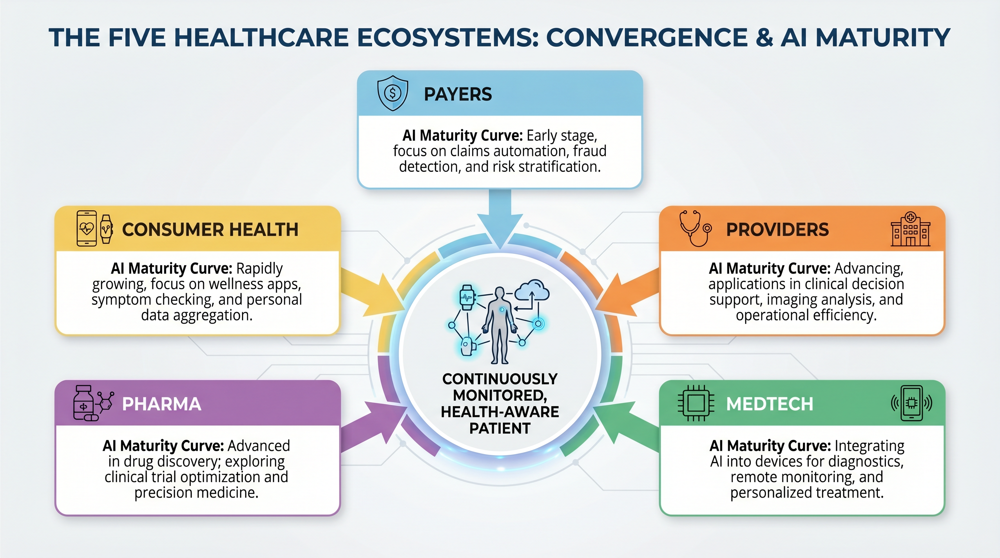
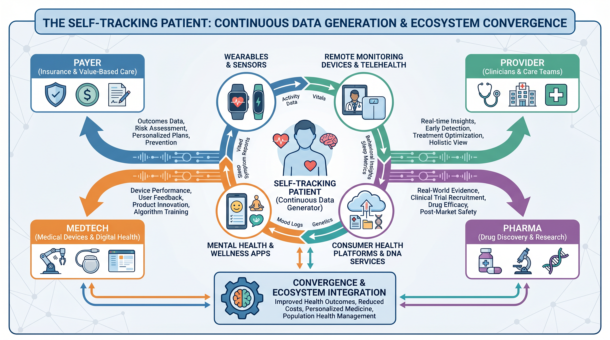
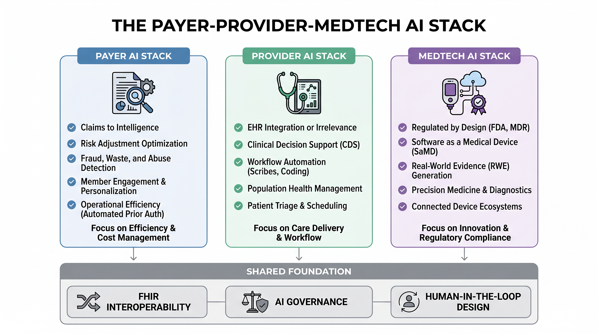
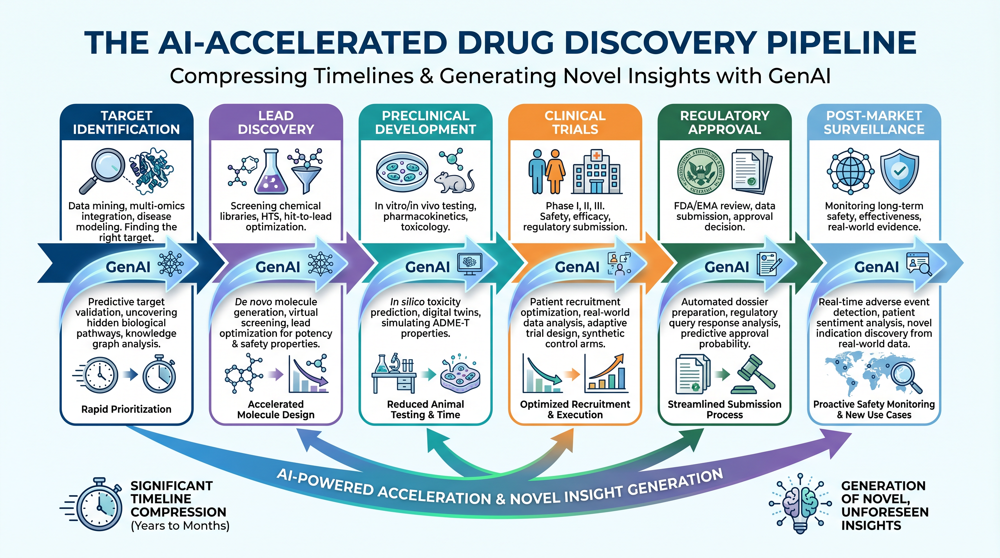

# Chapter 1 — Anatomy of a Healthcare Enterprise

*Five ecosystems, five AI maturity curves — and one converging patient at the center of all of them*

> **What This Chapter Covers:** The five distinct sectors of the healthcare enterprise and their AI maturity curves · Why payer, provider, MedTech, pharma, and consumer health each require a different deployment strategy · How AI use cases differ by workflow, data source, regulatory surface, and economic incentive · Why the self-tracking patient is restructuring the data architecture across all five sectors.
>
> **Why It Matters:** A solution designed for a payer's claims analytics engine cannot be copy-pasted into a hospital's clinical workflow, a medical device manufacturer's regulated product lifecycle, a pharmaceutical company's discovery pipeline, or a consumer health platform's engagement loop. Understanding the anatomy of each sector — its data, its workflow, its regulatory surface, and its AI readiness — is the prerequisite for building anything that reaches patients at scale.

---

## Opening: Five Worlds Inside One Industry

Healthcare looks, from the outside, like a single industry. It is not. It is five distinct enterprises — each with its own economic model, its own regulatory obligations, its own data architecture, and its own deeply held assumptions about what technology is for and who gets to deploy it. A payer is fundamentally an actuarial and risk-management organization. A hospital is a clinical operations organization. A medical device manufacturer is a regulated product company. A pharmaceutical organization is a research, evidence-generation, and commercial enterprise simultaneously. And the consumer health sector is something newer: a data-generating ecosystem that none of the other four planned for and all of them are now trying to integrate.

The mistake that many technology organizations make when they enter healthcare is treating these five worlds as variations of the same problem. They are not. The same model architecture can produce very different implementation questions depending on where it lands. In a payer, the question is whether the model changes outreach, risk adjustment, utilization management, or quality performance. In a provider, the question is whether it reduces clinical burden or merely adds another alert. In MedTech, the question is whether the model has become part of a regulated medical device. In pharma, the question is whether the model can be traced through discovery, trials, safety surveillance, and regulatory submission. In consumer health, the question is whether high-frequency personal data can be made useful without overstating its clinical meaning.

This book is structured to guide you through that landscape, building from foundational concepts to sector-specific applications, and culminating in the ethical, governance, and future considerations that will shape healthcare AI:

*   **Part I: Foundational Concepts** (Chapters 1-5) establishes the unique regulatory, data, and trust realities of healthcare AI, and explores what AI can and cannot do in this domain.
*   **Part II: Sector-Specific Applications** (Chapters 6-14) dives into practical deployment across MedTech, payer, provider, and pharma ecosystems, detailing real-world use cases and collaboration models.
*   **Part III: Governance, Ethics, and Equity** (Chapters 15-19) addresses the critical dimensions of AI governance, ethical deployment, measurement, patient participation, and social determinants of health.
*   **Part IV: The Future of Healthcare AI** (Chapters 20-21) looks at the evolving regulatory horizon and synthesizes all themes into the vision of the agentic clinic.

What is changing is that these five worlds are beginning to converge around a shared asset: the patient who tracks their own health. Continuous streams of biometric data, behavioral signals, medication adherence patterns, symptom logs, and patient-reported outcomes are flowing into clinical, payer, pharma, MedTech, and consumer health systems in ways that those systems were not designed to absorb. This convergence is not a future scenario. It is a present operational reality that every sector is navigating with varying degrees of readiness, enthusiasm, and regulatory anxiety.

*Figure 1.1 — The Five Healthcare Ecosystems. Each sector operates on distinct data, regulatory, and AI maturity foundations. All five are converging around the continuously monitored, health-aware patient.*

---

## Topic 1 — Five Ecosystems, Five Deployment Logics

The payer ecosystem is, at its core, a prediction business. The accuracy with which a health insurer can forecast which members will generate the highest costs in the next twelve months — and intervene effectively before those costs materialize — determines the financial performance of the enterprise. This makes payers early adopters of data and analytics technology. Most large payers have been running predictive risk models for years. What many have not yet built is the intelligence layer that connects those models to meaningful, timely, and measurable clinical action at the population level.

The provider ecosystem faces a different problem. Hospitals and health systems have deep clinical data, but their challenge is making that data actionable at the point of care without adding cognitive burden to clinicians who are already operating at or beyond capacity. The electronic health record is the central nervous system of the provider world. Any AI that cannot integrate meaningfully into clinical workflow will struggle to achieve adoption regardless of how accurate it is in a research setting.

The MedTech ecosystem introduces a layer of regulatory complexity that is qualitatively different from what payers and providers face. When a medical device manufacturer embeds AI into a device, it is creating a regulated artifact with its own classification, risk-management obligation, clinical evidence requirement, change-control process, and post-market surveillance expectation. In MedTech, AI is not merely a feature. It can become part of the product's safety and effectiveness claim.

The pharmaceutical ecosystem uses AI across a longer and more evidence-intensive arc. The visible story is drug discovery, but the practical enterprise use cases extend across target identification, molecule generation, trial design, site selection, patient recruitment, pharmacovigilance, medical affairs, regulatory writing, and real-world evidence. Pharma is not only asking whether AI can find a molecule. It is asking whether AI can compress scientific search, improve trial execution, monitor safety signals, and produce documentation that survives regulatory scrutiny.

The consumer health ecosystem is different again. Its primary strengths are engagement, frequency, and proximity to daily life. Wearables, wellness applications, fertility trackers, glucose monitors, behavioral health tools, nutrition platforms, and home diagnostics can observe patterns that the formal healthcare system sees only episodically. But consumer health also carries the greatest risk of ambiguity: not every signal is clinical-grade, not every recommendation is medical advice, and not every engagement loop improves health.

> *"The AI systems that fail in healthcare almost always fail because they were designed for one world and deployed into another."*

### Sector-by-Sector AI Use-Case Map

| Sector | Core data sources | Representative AI use cases | Primary adoption constraint |
|---|---|---|---|
| **Payer** | Claims, pharmacy, eligibility, care-management notes, quality measures, prior authorization history | Risk stratification, care-gap closure, utilization review, fraud/waste/abuse detection, member outreach prioritization, quality-measure performance | Turning prediction into intervention without creating denial-of-care, bias, or member-trust problems |
| **Provider** | EHR data, clinical notes, orders, labs, imaging, bedside monitoring, operational data | Ambient documentation, clinical decision support, sepsis and deterioration prediction, imaging triage, coding support, capacity and staffing optimization | Integrating into clinician workflow without increasing alert fatigue, liability exposure, or documentation burden |
| **MedTech** | Device sensor streams, imaging data, software logs, device performance data, clinical validation datasets | AI-enabled diagnostics, adaptive monitoring, robotic assistance, image analysis, device-quality surveillance, predictive maintenance | Demonstrating safety, effectiveness, software quality, and controlled change across the regulated product lifecycle |
| **Pharma** | Omics, chemistry, assay data, trial data, safety reports, real-world evidence, literature, regulatory documents | Target discovery, molecule generation, trial matching, protocol optimization, pharmacovigilance, regulatory drafting, medical information support | Maintaining traceability, scientific validity, human accountability, and submission-grade documentation |
| **Consumer health** | Wearable signals, app behavior, symptom logs, patient-reported outcomes, home diagnostics, lifestyle data | Personalized coaching, adherence support, remote monitoring, triage prompts, digital biomarkers, patient engagement | Separating wellness signal from medical claim while preserving privacy, consent, and clinical interpretability |

This map matters because it prevents a common category error. A model that performs well in one sector may fail in another not because the model is weak, but because the operational question is different. Payers optimize population intervention. Providers optimize point-of-care decisions. MedTech manufacturers optimize regulated product performance. Pharma optimizes scientific evidence and lifecycle documentation. Consumer health platforms optimize continuous engagement and behavior change. Healthcare AI strategy begins by knowing which of these worlds the system is actually entering.

*Figure 1.2 — The Self-Tracking Patient. Consumer-generated health data is flowing simultaneously into payer, provider, pharma, and MedTech systems — creating both an integration opportunity and a governance imperative.*

---

## Topic 2 — AI Use Cases Across the Healthcare Enterprise

The payer AI journey begins with data — and payer data, for all its limitations, is rich in retrospective signal. Claims data captures billable encounters. Pharmacy data captures dispensing and refill patterns. Quality-measure data reveals care gaps. Prior authorization history exposes utilization patterns. Increasingly, wearable and remote-monitoring data is entering payer environments through wellness programs and value-based care arrangements. The payer AI systems that generate measurable value are those that close the loop from risk identification to care-manager outreach, intervention tracking, outcome measurement, and quality improvement.

Medicare Advantage has become one of the proving grounds for payer AI in the United States because quality performance, risk adjustment, Stars, care gaps, and member experience all carry economic consequences. In this environment, AI is not simply a productivity tool. It is a population-health operating layer. The strongest payer use cases are not generic chatbots; they are systems that identify who is likely to deteriorate, which care gap should be closed next, which member needs human outreach rather than automated messaging, and which intervention actually changed the outcome.

For providers, the EHR is not merely a data repository. It is the workflow. Every clinical decision support tool, diagnostic AI, ambient documentation system, coding assistant, and operational model must fit into how clinicians actually work. The provider use cases that are breaking through are those that reduce burden or sharpen clinical attention: ambient note generation that gives time back to physicians, imaging triage that prioritizes urgent findings, deterioration models that surface the right patient at the right moment, and discharge or capacity models that help hospitals manage scarce beds and staff.

The provider challenge is that clinical environments are already saturated with alerts, dashboards, and documentation requirements. A provider AI system that adds another queue may be technically impressive and operationally useless. A provider AI system that removes work, improves signal quality, and preserves clinician judgment can become part of the care-delivery fabric. In the provider world, adoption is not won by model performance alone. It is won by workflow humility.

Medical device AI carries a regulatory surface area that grows with every capability added to the product. A MedTech company using AI to improve image interpretation, power a diagnostic algorithm, guide robotic intervention, monitor device performance, or personalize therapy is making claims that may affect patient safety. The companies building AI most successfully in MedTech are those that integrate regulatory science, software quality engineering, human factors, cybersecurity, clinical evidence generation, and post-market monitoring into a single product lifecycle process.

Pharma's AI landscape is broader than drug discovery, even though discovery gets the headlines. AI can help identify targets, generate molecules, predict toxicity, optimize protocols, match patients to trials, summarize safety narratives, detect pharmacovigilance signals, and support regulatory writing. The accountability question is real: when a generative system proposes a compound, drafts a clinical-study report section, or flags a safety signal, the organization must know which model was used, what data informed it, what human review occurred, and what final decision was made. Pharma's AI opportunity is enormous, but its documentation burden is equally significant.

Consumer health is the sector closest to daily life. Its AI use cases include coaching, nudges, adherence support, sleep and activity interpretation, symptom triage, mental health engagement, fertility tracking, nutrition feedback, and remote patient monitoring. The sector's strength is frequency: it can see behaviors and signals that the clinic sees only occasionally. Its weakness is that engagement is not the same thing as clinical validity. The more consumer health platforms move toward medical interpretation, the more they must confront evidence, consent, liability, and integration with formal care.

> **Expert Note — The Workflow Is the Product**
>
> Across all five sectors, durable AI deployments share one characteristic: they treat the human workflow as the primary design constraint, not the model accuracy metric. The workflow is the product. Everything else is infrastructure.

*Figure 1.3 — The Payer-Provider-MedTech AI Stack. Three sector-specific architectures converge on a shared foundation of interoperability, AI governance, and human-in-the-loop design.*

---

## Topic 3 — Convergence, Accountability, and the Patient at the Center

The health-aware, self-tracking patient is becoming a structural force rather than a demographic segment. This patient is not simply a consumer of healthcare services. They are a continuous generator of health data — biometric, behavioral, environmental, and self-reported — that the clinical system sees only in episodic snapshots. A patient with hypertension whose smartwatch records six weeks of abnormal trends before the next clinical appointment may be carrying intelligence that the care team cannot yet receive, interpret, or act on safely.

That data is landing differently in each sector. Payers see it as a potential input into prevention, risk stratification, wellness incentives, and care management. Providers see it as both an opportunity for remote monitoring and a liability challenge: if the system receives a signal, who is responsible for reviewing it? MedTech companies see a path toward devices that live simultaneously in clinical and home environments. Pharma sees digital biomarkers, patient-reported outcomes, adherence signals, and real-world evidence. Consumer health companies see the engagement layer that keeps patients connected between formal healthcare encounters.

### Sector Integration Reality — Where Consumer Data Is Landing Today

| Sector | Where consumer health data is entering today | Governance maturity |
|---|---|---|
| **Payers** | Wearable data feeding wellness incentive programs, care-management prioritization, and emerging risk-stratification inputs | Early — incentive frameworks are ahead of clinical-grade governance |
| **Providers** | Remote-monitoring programs, patient-generated data feeds, portal messages, and periodic EHR syncs | Early — workflow integration is outpacing data-quality, liability, and escalation frameworks |
| **MedTech** | Connected devices, companion applications, home diagnostics, and device-performance monitoring | Mixed — maturity depends on device classification, clinical claim, and post-market obligation |
| **Pharma** | Patient-reported outcomes, digital biomarkers, adherence data, decentralized-trial inputs, and real-world evidence pipelines | Emerging — regulatory expectations are forming around digital endpoints and data provenance |
| **Consumer health** | Coaching, engagement, wellness analytics, symptom tracking, and direct-to-consumer recommendations | Uneven — strong engagement capability but variable clinical validation, privacy posture, and integration with care teams |

The common governance question across all five sectors is not whether more data can be collected. It can. The question is whether the data can be interpreted responsibly, acted on safely, and documented in a way that preserves trust. In payer settings, this means preventing AI from becoming opaque rationing. In provider settings, it means preventing AI from becoming another source of cognitive overload. In MedTech, it means proving safety and effectiveness as the product changes. In pharma, it means preserving traceability from AI output to human decision. In consumer health, it means avoiding the dangerous middle ground where a product behaves like medical advice while claiming to be only wellness guidance.

*Figure 1.4 — The AI-Accelerated Drug Discovery Pipeline. Pharma remains one of the most technically advanced AI frontiers, but its accountability problem is one example of a broader enterprise-wide requirement: every sector must be able to trace AI-generated recommendations back to data, model behavior, human review, and final decision.*

> **Expert Note — Governance Lag**
>
> None of these integrations has a fully mature governance framework yet. Each sector is accepting new AI-generated or consumer-generated signal faster than it is defining what counts as decision-grade evidence, who is liable for acting on it, and how patient consent travels once data crosses sector boundaries.

---

## Chapter Close: Five Sectors, One Imperative

The anatomy of a healthcare enterprise is not a single organism. It is five distinct organisms — each with its own metabolism, immune system, incentive model, and relationship with technology. Payers need AI that converts prediction into responsible population-health action. Providers need AI that improves clinical work rather than adding noise. MedTech needs AI that can survive regulated product scrutiny. Pharma needs AI that accelerates science while preserving evidence and accountability. Consumer health needs AI that engages people continuously without confusing wellness signal for clinical truth.

Across all five sectors, the same imperative is asserting itself. The patient — no longer passive, no longer episodic, increasingly self-aware and self-monitoring — is generating data that every sector needs and none was fully designed to receive. Healthcare AI will not be built by treating the industry as one market. It will be built by understanding the five worlds inside it, then designing systems that can cross their boundaries without losing safety, trust, or accountability.

> *"The health-aware patient did not ask permission to join the healthcare enterprise. They simply arrived — and every sector is now deciding what to do with what they brought."*

---

## For Practitioners

Technical readers: a companion **[Practitioner Depth](practitioner.md)** page accompanies this chapter — regulatory data snapshots plus runnable, Colab-ready code.

---

*Chapter 1 · Preview edition. The complete book is in progress — [share feedback](https://github.com/zkumar/healthcare-ai-book-preview/issues).*
