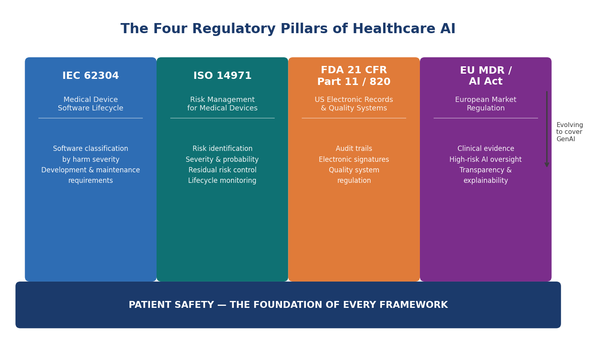
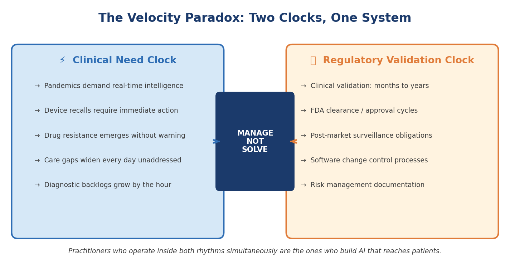
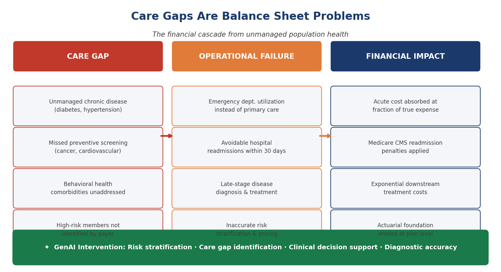
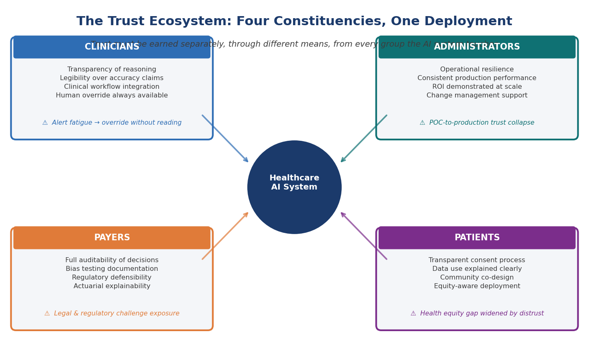

# Chapter 1 — The Regulated Machine

*Why healthcare is the hardest domain for AI — and why that makes it the most important*

> **What This Chapter Covers:** The regulatory architecture that governs healthcare AI · Why care gaps and population-health failures are financial crises · How trust — earned differently from clinicians, payers, administrators, and patients — determines whether any deployment succeeds.
>
> **Why It Matters:** Understanding these three realities is the prerequisite for every technical, operational, and strategic decision that follows. Skip this foundation, and every subsequent chapter is built on sand.

---

## Opening: The Stakes Are Different Here

There is a phrase that became the unofficial motto of the digital age: *move fast and break things*. It built social networks, disrupted industries, and minted a generation of billionaires. It also has no place in a hospital. In healthcare, the things that break are not features or quarterly projections. They are diagnoses. They are treatment pathways. They are people. This is not a philosophical objection to speed — it is a structural reality of the domain. And it is the first thing that anyone who wants to deploy artificial intelligence in a clinical or insurance environment must internalize, completely and without exception.

Healthcare is not simply another vertical for AI to conquer. It is a fundamentally different operating environment — one where innovation velocity collides daily with a regulatory architecture built over decades of hard lessons. These frameworks did not emerge from bureaucratic imagination. They emerged from failures — devices that harmed patients, software that miscalculated doses, systems that were trusted before they had earned that trust. Understanding them is not a compliance exercise. It is a prerequisite for building anything that lasts.

And yet the urgency has never been greater. Hospitals operate on margins so thin that a single percentage-point shift in avoidable readmissions can determine whether a service line survives the fiscal year. Health insurers manage claim volumes and risk pools of staggering complexity. Care gaps — the invisible distances between what a patient needs and what the system actually delivers — are simultaneously a public-health crisis and an institutional financial drain. This chapter examines why that gap exists, what it will take to close it, and why the organizations that close it first will define the next era of healthcare delivery.

> *"The regulated machine is not a constraint on what healthcare AI can become. It is the reason that what healthcare AI becomes will actually matter."*

---

## Topic 1 — The Regulatory Reality: Governance Is Not the Enemy of Innovation

There is a temptation, especially among technologists entering healthcare for the first time, to view regulation as friction. As the thing that slows the good idea down, that buries the promising pilot in paperwork, that keeps the breakthrough locked in a proof-of-concept environment while patients who could benefit wait. This temptation is understandable. It is also dangerous. Because the moment a team begins treating regulatory compliance as an obstacle to route around rather than a standard to build toward, they have already made the most consequential architectural mistake of their project — and they will discover it at the worst possible time.

*Figure 1.1 — The Four Regulatory Pillars of Healthcare AI. Each framework was forged from real-world failure. Together they define the architectural constraints within which all healthcare AI must operate.*

**IEC 62304** — the international standard for medical device software lifecycle processes — exists because software in clinical environments had failed in ways that were invisible until they were catastrophic. It mandates that software be classified by the severity of harm its failure could cause, and that the rigor of development, testing, and maintenance be proportional to that classification. A Class C software item — one whose failure could result in death or serious injury — demands a level of documentation, traceability, and verification that most enterprise software teams have never encountered. This is not bureaucracy for its own sake. It is an acknowledgment that in a medical device, a software defect is not a bug ticket. It is a patient-safety event.

**ISO 14971** extends this thinking into the domain of risk management. Where most technology organizations think about risk in terms of probability, ISO 14971 demands a more complete analysis. What is the severity of harm if it does go wrong? What is the probability of that harm reaching a patient given the controls in place? What residual risk remains after mitigation, and is that residual risk acceptable against the clinical benefit the device provides? For AI systems, this framework introduces a profound challenge. Traditional software has deterministic failure modes. A model trained on historical data has probabilistic ones.

**FDA 21 CFR Part 11** governs electronic records and electronic signatures in regulated environments — the foundational requirement that every action taken by a software system in a clinical context be traceable, auditable, and tamper-evident. **Part 820** sets the broader framework for how medical devices must be designed, manufactured, and monitored across their entire lifecycle. Together, these provisions create an obligation that the training data, the model architecture, the validation methodology, the deployment environment, and the monitoring strategy — all of it — must be documented, controlled, and defensible to a federal auditor.

*Figure 1.2 — The Velocity Paradox. Clinical urgency and regulatory validation operate on irreconcilably different timescales. The practitioner's role is not to resolve this tension but to operate effectively within it.*

The European regulatory landscape adds further dimension. The **EU Medical Device Regulation (MDR)** tightened clinical-evidence requirements significantly. The **EU AI Act** designates AI systems used in clinical decision-making as high-risk, imposing transparency, explainability, and human-oversight requirements that the most thoughtful healthcare AI practitioners have already recognized as non-negotiable. Innovation does not require the absence of regulation. It requires the maturity to build within it.

> **Expert Note — Governance as Architecture**
>
> The governance layer is not the last thing you build — it is the first. The organizations that have stopped asking *"how do we get our AI approved?"* and started asking *"how do we build AI that deserves to be approved?"* are the ones producing systems that survive contact with clinical reality.

---

## Topic 2 — The Operational and Financial Imperative: Care Gaps Are Balance-Sheet Problems

There is a conversation that happens regularly in healthcare boardrooms, and it usually goes one of two ways. The first version is a clinical conversation — about quality metrics, patient outcomes, HEDIS scores, and the moral obligation of a health system to close the gaps between what its patients need and what they actually receive. The second is a financial conversation — about margin compression, avoidable costs, revenue leakage, and the existential arithmetic of running a healthcare institution in an era of shrinking reimbursements and rising operational complexity. What makes this moment in healthcare history genuinely significant is that artificial intelligence is making these two conversations inseparable.

*Figure 1.3 — The Care Gap Financial Cascade. Every unmanaged care gap generates an operational failure that translates directly into institutional financial exposure. GenAI intervenes at every stage of this chain.*

A hospital operating on a two-to-three-percent net margin has almost no tolerance for inefficiency at the population level. Every patient with uncontrolled diabetes who arrives in the emergency department instead of being managed proactively represents a cost event that the system absorbs at a fraction of its true expense. Every preventable readmission within thirty days of discharge triggers a Medicare penalty and erases the margin contribution of the original admission. The insurance dimension is equally stark. A risk-stratification model that systematically underestimates the complexity of a particular member segment produces an underfunded care-management program, an inadequately priced premium, and a claims experience that erodes the actuarial foundation the entire plan is built on.

GenAI-powered clinical decision support changes the dynamic fundamentally. Instead of generating alerts from rules, it generates insights from context. It understands the specific patient in front of the clinician, the specific clinical question being asked, and the specific evidence base most relevant to that question at that moment. It does not add noise to an already noisy environment. It reduces noise and surfaces signal.

> **Expert Note — The Core Reframe**
>
> GenAI in healthcare is not a cost center — it is a recovery mechanism. It recovers revenue lost to avoidable admissions, margin eroded by inaccurate risk stratification, and quality scores degraded by care gaps that no human workforce has the bandwidth to close manually across an entire patient population.

---

## Topic 3 — The Trust Deficit: The Last Mile No Algorithm Can Automate

There is a moment that every healthcare AI deployment eventually reaches. The model has been trained, validated, and stress-tested. The accuracy metrics are strong. The regulatory documentation is in order. The executive sponsor has signed off. And then the system meets the people it was built to serve — the radiologist who glances at the AI recommendation and overrides it without reading the confidence score, the care manager who receives the risk-stratification output and routes it to a generic queue where it will age unactioned, the patient who declines the AI-assisted service because no one explained what the system was doing with their data. Trust in healthcare AI is not a single thing. It must be earned separately, through different means, from every constituency the system touches.

*Figure 1.4 — The Trust Ecosystem. Each constituency requires a distinct trust-building strategy. The AI system at the center is only as effective as the trust network surrounding it.*

### The Trust Ecosystem — Constituency Requirements

| Constituency | Primary Trust Currency | What Earns It | What Erodes It |
|---|---|---|---|
| **Clinicians** | Legibility over accuracy | Systems that show their reasoning, expose confidence, and explain uncertainty alongside conclusions | Verdict-style outputs without rationale; opaque models delivered as black boxes |
| **Administrators** | Resilience over performance | Predictable behavior under degraded data quality and staff turnover; operational workflow co-designed with the model | Pilot success that fails to survive production conditions; models deployed without surrounding workflow change |
| **Payers** | Auditability over efficiency | Plain-language reconstruction of any decision the model produced; demonstrable absence of discriminatory bias | Explainability treated as a feature rather than as institutional defense; outputs that cannot be defended in regulatory or legal proceedings |
| **Patients** | Equity over adoption | Transparent communication; community engagement; genuine co-design with historically underserved populations | Deployments that treat adoption metrics as success while reproducing existing disparities |

> **Expert Note — Building Trust in Practice**
>
> Human-in-the-loop design that is genuinely not performative · audit trails readable by humans · model monitoring that surfaces drift before it becomes a patient-safety event · communication strategies that respect patient intelligence · institutional humility — the capacity to acknowledge when a model is not working and course-correct transparently.

---

## Chapter Close: The Foundation Everything Else Is Built On

Healthcare is not the hardest domain for AI despite its stakes. It is the hardest domain for AI because of them. The regulatory frameworks that govern it are demanding because the cost of failure is irreversible. The operational and financial pressures that drive it are acute because the institutions navigating them have no margin for error — literally. And the trust that every deployment must earn, from every constituency it touches, is difficult because it was never freely given in any domain where the relationship between technology and human welfare is this direct and this consequential.

> *"Every chapter that follows is, in one way or another, about how to build on that foundation — and what it costs when you try to skip it."*

---

---

*Chapter 1 · Preview edition. The complete book is in progress — [share feedback](https://github.com/zkumar/healthcare-ai-book-preview/issues).*
