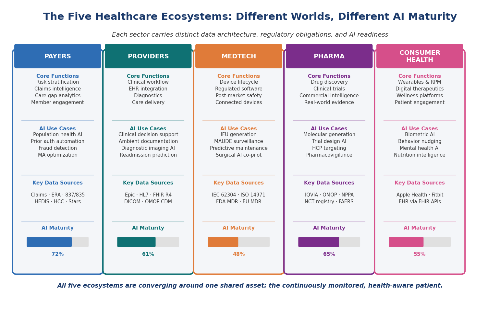
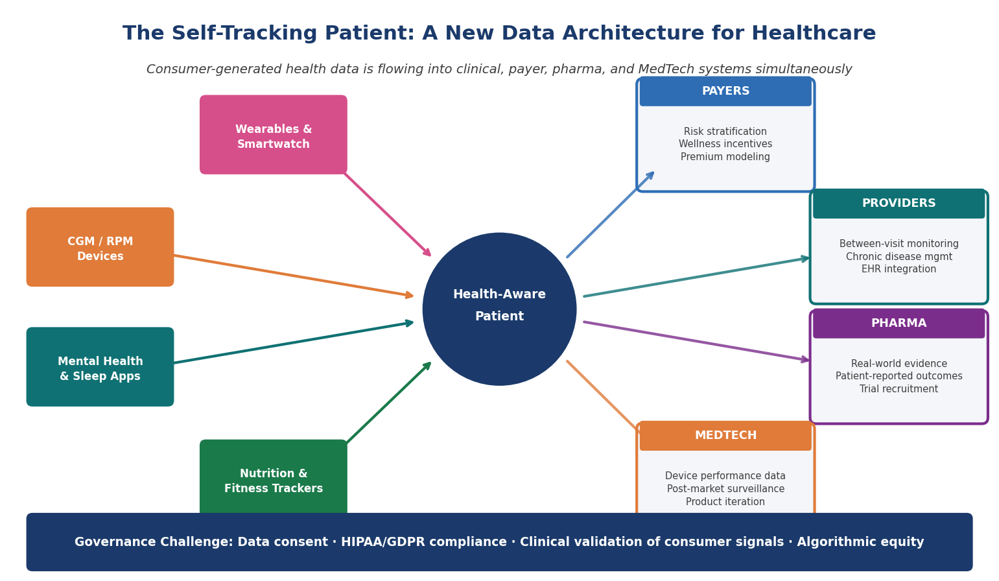
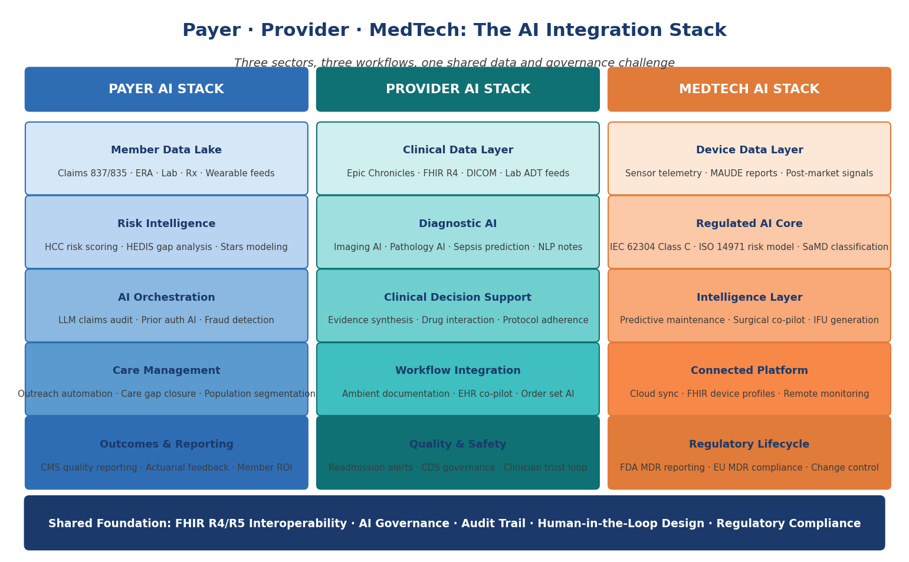
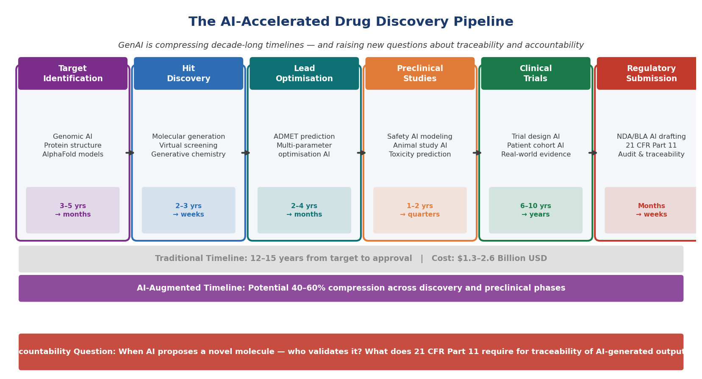

# Chapter 2 — Anatomy of a Healthcare Enterprise

*Five ecosystems, five AI maturity curves — and one converging patient at the center of all of them*

> **What This Chapter Covers:** The five distinct sectors of the healthcare enterprise and their AI maturity curves · Why payer, provider, MedTech, pharma, and consumer health each require a different deployment strategy · How the self-tracking patient is restructuring the data architecture across all five sectors · Why drug discovery represents AI's most consequential frontier — and its sharpest accountability challenge.
>
> **Why It Matters:** A solution designed for a payer's claims analytics engine cannot be copy-pasted into a medical device manufacturer's regulatory lifecycle. Understanding the anatomy of each sector — its data, its workflow, its regulatory surface, and its AI readiness — is the prerequisite for building anything that reaches patients at scale.

---

## Opening: Five Worlds Inside One Industry

Healthcare looks, from the outside, like a single industry. It is not. It is five distinct enterprises — each with its own economic model, its own regulatory obligations, its own data architecture, and its own deeply held assumptions about what technology is for and who gets to deploy it. A payer is fundamentally an actuarial and risk-management organization. A hospital is a clinical operations organization. A medical device manufacturer is a regulated product company. A pharmaceutical organization is a research and commercial enterprise simultaneously. And the consumer health sector is something entirely new — a data-generating ecosystem that none of the other four planned for and all of them are now trying to integrate. The mistake that most technology organizations make when they enter healthcare is treating these five worlds as variations of the same problem. They are not.

What is changing is that these five worlds are beginning to converge around a single shared asset: the patient who tracks their own health. The continuous streams of biometric data, behavioral signals, and self-reported health information being generated by wearables, remote monitoring devices, mental health applications, and consumer health platforms are flowing into clinical, payer, pharma, and MedTech systems in ways that none of those systems were designed to absorb. This convergence is not a future scenario. It is a present operational reality that every sector is navigating with varying degrees of readiness, enthusiasm, and regulatory anxiety.

*Figure 2.1 — The Five Healthcare Ecosystems. Each sector operates on distinct data, regulatory, and AI maturity foundations. All five are converging around the continuously monitored, health-aware patient.*

---

## Topic 1 — Five Ecosystems, One Converging Patient

The payer ecosystem is, at its core, a prediction business. The accuracy with which a health insurer can forecast which members will generate the highest costs in the next twelve months — and intervene effectively before those costs materialize — determines the financial performance of the entire enterprise. This makes payers, almost by necessity, early adopters of data and analytics technology. Most large payers have been running predictive risk models for over a decade. What they have not yet built, in most cases, is the intelligence layer that connects those models to meaningful clinical action at the population level.

The provider ecosystem faces a different problem. Hospitals and health systems have the clinical data but face the challenge of making that data actionable at the point of care without adding cognitive burden to clinicians who are already operating at or beyond capacity. The electronic health record is the central nervous system of the provider world, and Epic dominates it with a market share that makes it the operating system of American hospital medicine. Any AI that cannot integrate meaningfully into Epic will not achieve clinical adoption regardless of how accurate it is in a research setting.

> *"The AI systems that fail in healthcare almost always fail because they were designed for one world and deployed into another."*

The MedTech ecosystem introduces a layer of regulatory complexity that is qualitatively different from what payers and providers face. When a medical device manufacturer embeds AI into a device, it is creating a regulated artifact with its own classification, its own risk-management obligation, and its own post-market surveillance requirement. Consumer health sits outside the traditional regulatory perimeter — and that is precisely what makes it both an opportunity and a governance challenge.

*Figure 2.2 — The Self-Tracking Patient. Consumer-generated health data is flowing simultaneously into payer, provider, pharma, and MedTech systems — creating both an integration opportunity and a governance imperative.*

What ties all five sectors together at this moment is the arrival of the health-aware, self-tracking patient as a structural force rather than a demographic segment. This patient is not simply a consumer of healthcare services. They are a continuous generator of health data — biometric, behavioral, environmental, and self-reported — that the clinical system sees only in episodic snapshots. A patient with hypertension whose smartwatch has recorded elevated resting heart rate variability for six consecutive weeks before their next clinical appointment is carrying intelligence that their cardiologist does not have access to. The quantified-self movement did not ask permission to join the healthcare enterprise. It simply arrived.

### Sector Integration Reality — Where Consumer Data Is Landing Today

| Sector | Where consumer health data is entering today | Governance maturity |
|---|---|---|
| **Payers** | Wearable data feeding wellness incentive programs and emerging risk-stratification inputs | Early — incentive frameworks ahead of clinical-grade governance |
| **Providers** | Remote-monitoring program pilots; periodic syncs into the EHR | Early — workflow integration outpacing data-quality and liability frameworks |
| **Pharma** | Patient-reported outcomes and digital biomarkers entering real-world evidence pipelines | Emerging — regulatory expectations forming around digital endpoints |
| **MedTech** | Devices designed to live simultaneously in clinical and consumer ecosystems | Mixed — depends on FDA classification of the device and its companion app |

> **Expert Note — Governance Lag**
>
> None of these integrations has a fully mature governance framework yet. Each sector is accepting consumer-generated data faster than it is defining what counts as clinical-grade signal, who is liable for acting on it, and how patient consent travels with the data once it crosses sector boundaries.

---

## Topic 2 — Payers, Providers and MedTech: Where AI Meets Workflow and Regulation

If there is a single principle that separates successful healthcare AI deployments from unsuccessful ones across the payer, provider, and MedTech sectors, it is this: the deployment environment is not a server. It is a human workflow. And human workflows in healthcare are among the most complex, politically sensitive, and cognitively loaded environments that any technology has ever been asked to enter.

*Figure 2.3 — The Payer-Provider-MedTech AI Stack. Three sector-specific architectures converging on a shared foundation of FHIR interoperability, AI governance, and human-in-the-loop design.*

### The Payer AI Stack — From Claims to Intelligence

The payer AI journey begins with data — and payer data, for all its limitations, is extraordinarily rich in retrospective signal. Claims data captures virtually every clinical encounter that results in a billable event. Pharmacy data captures medication adherence. And increasingly, wearable and remote-monitoring data is entering payer data lakes through wellness program integrations. The payer AI systems generating measurable ROI are those that close the loop — from risk identification to care manager outreach to intervention tracking to outcome measurement — within a single orchestrated workflow.

Medicare Advantage has become the proving ground for payer AI in the United States. The Star Ratings system creates direct financial incentives for quality performance. HEDIS measure gaps translate into revenue at risk. HCC coding accuracy determines risk adjustment payments that can represent hundreds of millions of dollars annually for large plans. In this environment, AI is not a productivity tool. It is a financial performance mechanism.

### The Provider AI Stack — EHR Integration or Irrelevance

For providers, the EHR is not a data repository. It is the workflow. Every clinical decision support tool, every diagnostic AI, every ambient documentation system must integrate into the EHR workflow or it will not be used. The AI systems breaking through alert fatigue are not the ones generating more alerts. They are the ones generating fewer, better-calibrated signals — surfacing only the findings that change clinical management.

### The MedTech AI Stack — Regulated by Design

Medical device AI carries a regulatory surface area that grows with every capability added to the product. The MedTech companies building AI most successfully are those that have integrated regulatory science, software quality engineering, and clinical evidence generation into a single product lifecycle process. IEC 62304 defines how they build it. ISO 14971 defines how they manage its risk. FDA SaMD guidance defines what evidence they need to support it.

> **Expert Note — The Workflow Is the Product**
>
> Across all three sectors, the organizations producing durable AI deployments share one characteristic: they treat the human workflow as the primary design constraint, not the model accuracy metric. The workflow is the product. Everything else is infrastructure.

---

## Topic 3 — Pharma, Drug Discovery and the AI Accountability Question

Of all the claims being made about generative AI in healthcare, the ones being made in pharmaceutical drug discovery are simultaneously the most extraordinary and the most credible. This is not a domain where AI is being used to write better emails or summarize clinical notes. It is a domain where AI is being used to discover new drugs — to identify therapeutic targets that human scientists would not have found, to generate molecular structures that have never existed in nature, and to predict the biological behavior of compounds with a speed and breadth that traditional experimental methods cannot approach.

*Figure 2.4 — The AI-Accelerated Drug Discovery Pipeline. GenAI is compressing decade-long timelines across discovery and preclinical phases — while simultaneously raising unresolved questions about traceability, validation, and regulatory accountability.*

### What AI Is Actually Doing in Drug Discovery

The AlphaFold moment changed the conversation about AI in drug discovery permanently. When DeepMind's protein structure prediction system achieved near-experimental accuracy in 2020, it demonstrated that a computational system could solve a problem that had occupied structural biologists for half a century. Since AlphaFold, foundation models trained on genomic sequences and chemical structures are generating novel drug candidates at a speed that no wet lab can match. And the health-aware, self-tracking patient population is now providing real-world evidence that is beginning to enter pharmacovigilance systems in ways not possible five years ago.

### The Accountability Question That Cannot Be Deferred

When a generative AI system proposes a novel molecular structure, the question of who is responsible for validating that proposal does not have a clean answer yet. FDA 21 CFR Part 11 requires that electronic records in regulated processes be attributable, accurate, contemporaneous, original, and legible. When the record is a generative AI output, what does attributability mean? The companies navigating this most effectively are those that have invested in AI documentation infrastructure — capturing the model version, the input data, the output generated, the human review, and the final decision made — for every AI-influenced decision in a regulated workflow.

> **Expert Note — Documentation Before Guidance**
>
> AI systems are infusing into drug-development workflows faster than governance frameworks can validate them. The organizations building AI documentation infrastructure now are the ones that will have defensible regulatory submissions when agency guidance catches up.

---

## Chapter Close: Five Sectors, One Imperative

The anatomy of a healthcare enterprise is not a single organism. It is five distinct organisms — each with its own metabolism, its own immune system, and its own relationship with the technology being introduced into it. But across all five sectors, the same imperative is asserting itself. The patient — no longer passive, no longer episodic, increasingly self-aware and self-monitoring — is generating data that every sector needs and none was fully designed to receive.

> *"The health-aware patient did not ask permission to join the healthcare enterprise. They simply arrived — and every sector is now deciding what to do with what they brought."*

---

---

*Chapter 2 · Preview edition. The complete book is in progress — [share feedback](https://github.com/zkumar/healthcare-ai-book-preview/issues).*
