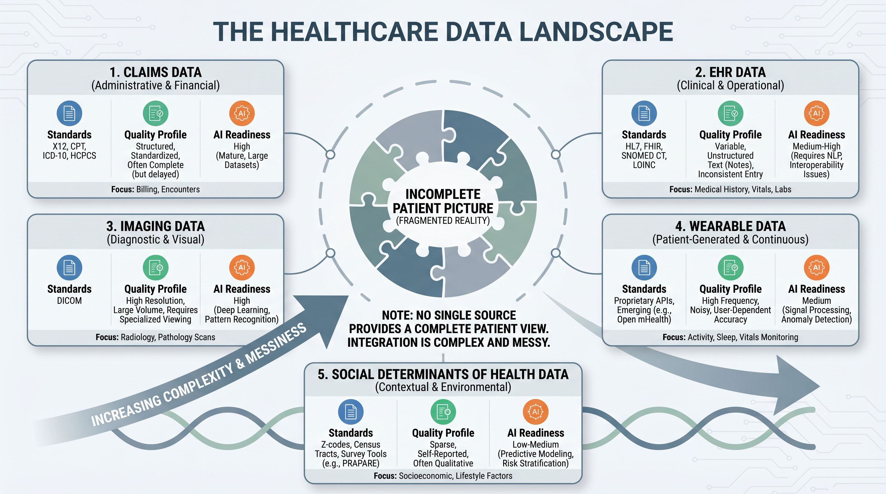
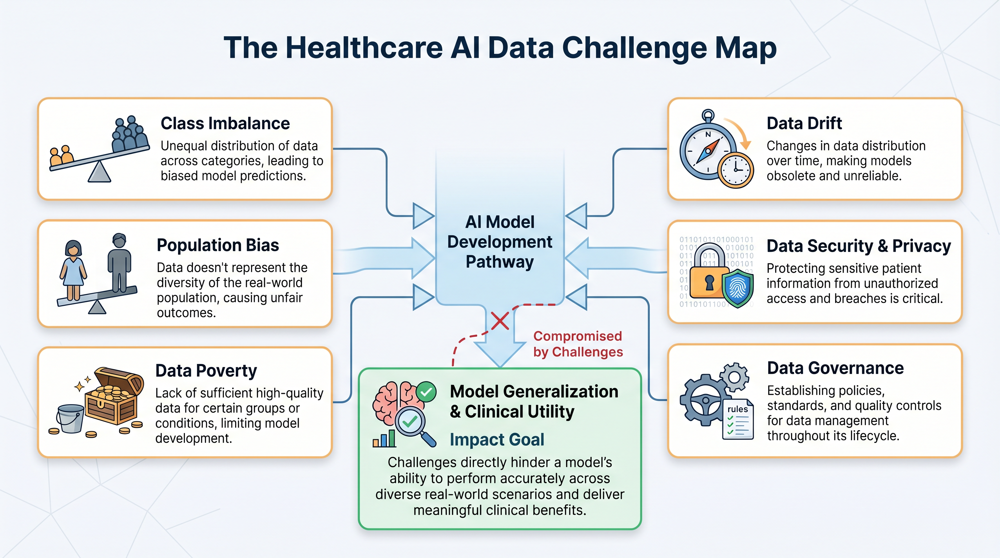
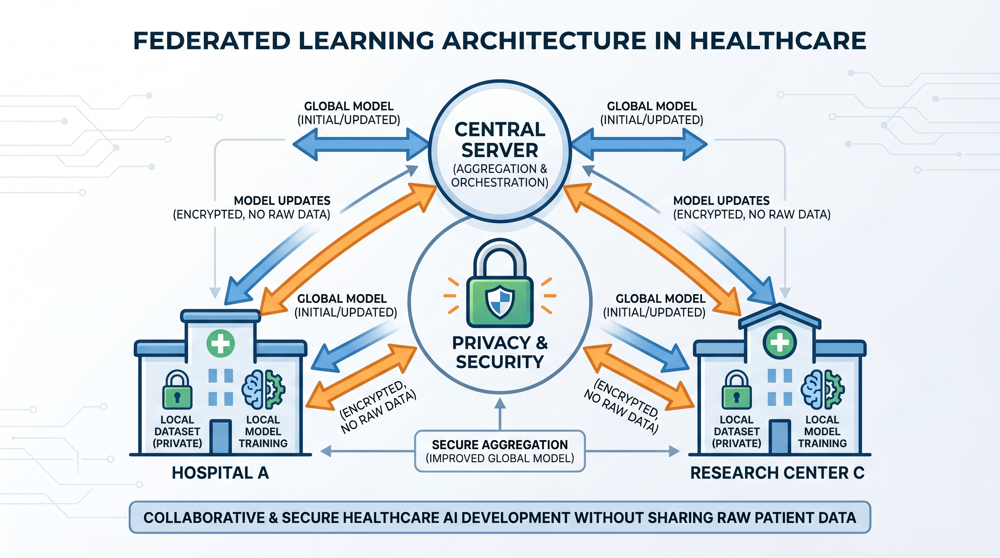
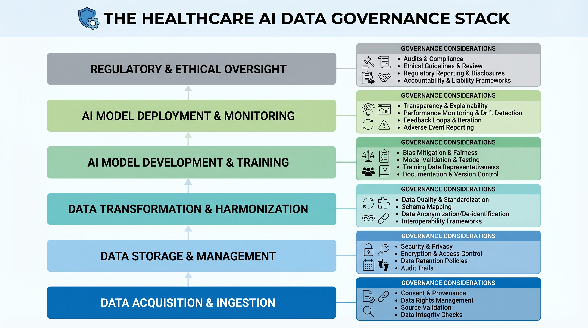

# Chapter 3 — The Data Reality

*Why healthcare data is the most complex, most consequential, and most misunderstood raw material in artificial intelligence*

> **What This Chapter Covers:** The five major healthcare data sources and their quality profiles · Six structural AI data challenges unique to healthcare · Federated learning as a privacy-preserving response to data scarcity · Data governance as the architecture that determines what can and cannot be deployed.
>
> **Why It Matters:** Every AI system is only as good as the data it learns from. In healthcare, that data is messier, more biased, more legally constrained, and more clinically consequential than in virtually any other domain. Understanding the data reality is not preliminary to building healthcare AI — it is building healthcare AI.

---

## Opening: The Pipeline That Does Not Exist

In almost every AI vendor presentation, there is a slide that shows a clean, linear pipeline. Data flows from source systems into a lake. The lake feeds a feature engineering layer. The feature layer feeds a model. The model outputs a prediction. The prediction drives a clinical or operational decision. It is a beautiful diagram. It bears almost no relationship to the experience of anyone who has actually tried to build healthcare AI at production scale.

The reality is that healthcare data is not a pipeline. It is a delta — a constantly shifting landscape of partially overlapping, inconsistently formatted, legally constrained, and clinically meaningful data sources that were built by different organizations, for different purposes, over different decades, using different standards that were themselves implemented differently by every institution that adopted them. Claims data captures what was billed, not necessarily what happened clinically. EHR data captures what was documented, not necessarily what was observed. Imaging data captures what the scanner acquired, not necessarily what was diagnostically relevant. Wearable data captures what the sensor measured, not necessarily what it means in a clinical context. And the gaps between these sources — the data that is missing, the patient journey that falls between systems, the social determinant that never made it into any structured field — carry some of the most clinically important signal in the entire dataset.

This chapter does not tell a pessimistic story. It tells an honest one. The organizations that build healthcare AI on a realistic understanding of their data — its limitations, its biases, its governance constraints, and its genuine richness — are the ones that produce models that work in production. The ones that build on the vendor slide are the ones that discover the gap between pilot performance and deployment performance, and spend the next eighteen months trying to understand why their model worked in the demo environment and failed in the real one.

> *"The absence of data in healthcare is not noise. It is signal. AI systems that treat it as noise produce models that fail in exactly the populations that need them most."*

*Figure 3.1 — The Healthcare Data Landscape. Five major source categories, each with distinct standards, quality profiles, and AI readiness levels. No single source contains the complete patient picture.*

---

## Topic 1 — The Data Reality: Messiness, Missingness, and the Myth of the Clean Pipeline

Claims data is the richest longitudinal record most payers and many health systems have for their populations — and it is retrospective, administratively coded, and subject to billing optimization pressures that have nothing to do with clinical accuracy. An ICD-10 diagnosis code on a claim tells you what a clinician documented in a way that would support reimbursement, which is not always the same thing as what they observed, what they suspected, or what actually caused the patient to present. The difference between a primary diagnosis and a secondary diagnosis on a claim can reflect clinical reality, coding convention, or the revenue cycle optimization priorities of the billing department. AI systems that treat claims codes as ground truth are learning a representation of clinical reality that has been filtered through an administrative process designed for payment, not for knowledge.

EHR data is richer clinically — but presents a different class of problems. The structured fields in an EHR capture a fraction of what a clinical encounter contains. The rest lives in the free-text clinical note — the physician narrative, the nursing assessment, the social work observation — that carries the nuance, the uncertainty, the differential diagnosis, and the social context that no structured field was designed to hold. Studies consistently show that between sixty and seventy percent of clinically relevant information in a patient record exists only in unstructured text. An AI system that processes only the structured EHR fields is operating on less than half the available signal. And extracting the remainder requires clinical natural language processing — a field with its own complexity, its own validation challenges, and its own failure modes, which Chapter 4 addresses in depth.

### The Missingness Problem

Of all the data quality challenges in healthcare AI, missingness is the one most frequently underestimated and most consequentially mishandled. Standard machine learning approaches to missing data — mean imputation, median substitution, dropping incomplete records — are appropriate when data is missing at random. In healthcare, data is almost never missing at random. A blood pressure reading is missing because the patient did not present for their appointment. A smoking history is missing because the clinician did not ask, or the patient did not disclose, or the intake form was not completed. A social determinants of health assessment is missing because the health system does not systematically collect it. Each of these missingness patterns carries clinical information. Imputing a missing blood pressure reading with the population mean does not just introduce statistical error — it erases the clinical signal that the patient was not being monitored, which may be the most important thing the model needs to know.

The correct approach to missingness in healthcare AI is not imputation. It is interrogation. Before any missing value strategy is applied, the analyst must ask: why is this value missing? Is the missingness itself predictive of the outcome I am modeling? Is it correlated with demographic or socioeconomic variables in ways that could introduce bias? Answers to these questions determine not just the imputation strategy but the entire feature engineering approach — and often reveal data quality issues in the source system that no amount of downstream modeling can compensate for.

### The Standards Reality

FHIR R4 represents the most significant advance in healthcare data interoperability in a generation — and its real-world implementation is substantially more complex than its specification suggests. Every major EHR vendor implements FHIR profiles differently. Epic's FHIR API exposes a specific subset of its data model through specific resource types with specific extensions. Oracle Health implements a different subset with different extension conventions. A FHIR integration that works against one vendor's API requires meaningful adaptation to work against another's. The standard provides a common language. It does not provide a common dialect.

HL7 v2 messages — the older messaging standard that still dominates hospital ADT feeds, lab result delivery, and order communications — present a different challenge. HL7 v2 is enormously flexible, which means that every institution has implemented it slightly differently. The same segment in an HL7 v2 message may carry different content, in different fields, using different local codes, depending on which hospital system sent it and which decade their interface engine was configured. Parsing HL7 v2 at scale across multiple institutions requires institution-specific mapping tables, continuous maintenance as source systems change, and a tolerance for edge cases that no specification document fully anticipates. DICOM, the standard for medical imaging data, adds a further dimension — its metadata headers are inconsistently populated across institutions and equipment manufacturers, creating normalization challenges that imaging AI teams spend significant engineering effort addressing before any model training begins.

> **Expert Note — Data Cleaning as Domain Expertise**
>
> In healthcare AI, data cleaning is not a preprocessing step. It is a domain expertise exercise. Every transformation applied to raw healthcare data — every imputation, every normalization, every mapping decision — embeds a clinical assumption. Those assumptions must be made explicit, documented, and validated by someone with both technical and clinical knowledge. The analyst who cleans the data without clinical input is making clinical decisions without clinical accountability.

---

## Topic 2 — Data Challenges for AI: Bias, Drift, Poverty, and the Federated Response

The data challenges facing healthcare AI are not simply engineering problems to be solved with better pipelines and larger compute budgets. They are epistemological problems — challenges in how AI systems come to know what they know, and whether what they know is actually true for the populations they will serve. Six structural challenges define this landscape, and understanding each of them is a prerequisite for building models that generalize beyond the training environment.

*Figure 3.2 — The Healthcare AI Data Challenge Map. Six structural data challenges that determine whether a model generalizes to production populations or fails silently on the patients who need it most.*

### Class Imbalance and Rare Disease Modeling

Healthcare outcomes are inherently imbalanced. Sepsis affects a small fraction of hospital admissions. Rare diseases affect a tiny fraction of the population. Even common conditions like myocardial infarction represent a minority of emergency department presentations. A model trained on an imbalanced dataset without explicit handling of that imbalance will learn, quite rationally, that the best strategy is to predict the majority class. A sepsis prediction model that predicts "no sepsis" for every patient achieves impressive accuracy on a dataset where ninety-five percent of patients do not develop sepsis — and is completely useless clinically. Addressing class imbalance in healthcare AI requires a combination of resampling strategies, cost-sensitive learning approaches, and — critically — evaluation metrics that reflect clinical priorities rather than statistical convenience. Accuracy is almost never the right metric for a healthcare AI model. Sensitivity, specificity, positive predictive value, and the clinical cost asymmetry between false positives and false negatives are the metrics that matter.

### Population Bias and the Generalization Gap

The majority of published healthcare AI research is conducted on data from large academic medical centers — institutions with sophisticated EHR implementations, high data quality standards, and patient populations that skew toward insured, educated, and urban demographics. The models produced from this research are then applied to community hospitals, rural health systems, federally qualified health centers, and Medicaid populations where the patient demographics, the clinical coding practices, the data quality, and the disease presentation patterns are systematically different. The result is a generalization gap — a measurable decline in model performance when a system moves from the population it was trained on to the population it is actually deployed to serve.

This gap is not an accident. It is a predictable consequence of training data that does not represent the deployment population. Addressing it requires either retraining on locally representative data — which requires data access, computational resources, and clinical validation capacity that many deployment sites do not have — or building models with explicit domain adaptation capabilities that can adjust to new populations with minimal additional labeled data. Neither solution is straightforward. Both are more tractable when the problem is acknowledged from the beginning of the model development process rather than discovered at deployment.

### Data Poverty and the Equity Imperative

Data poverty is the condition in which certain patient populations are systematically underrepresented in healthcare datasets — not because they do not exist or do not experience disease, but because they interact with the healthcare system less frequently, less consistently, and through channels that generate less structured data. Communities experiencing data poverty include uninsured and underinsured populations whose interactions with the healthcare system are episodic and emergency-driven rather than continuous and preventive. They include populations with historical reasons to distrust medical institutions whose data is sparse because engagement is low. They include rural populations whose geographic isolation limits access to the data-generating clinical infrastructure that urban populations take for granted.

The consequence for AI is direct and serious: the populations most in need of AI-assisted care are the ones least well represented in the training data used to build that care. A population health AI system trained on commercially insured data will systematically underestimate risk in Medicaid populations. A diagnostic AI trained on data from tertiary academic centers will perform less well on patients whose disease presentations reflect the comorbidity profiles and social determinants common in underserved communities. Data poverty does not just produce models that perform poorly on certain populations. It produces models that fail invisibly — that appear to work on aggregate metrics while systematically underserving the patients whose outcomes are most dependent on getting the prediction right.

### Federated Learning: A Partial Response

Federated learning has emerged as one of the most promising technical responses to the interrelated challenges of data scarcity, institutional privacy constraints, and population underrepresentation. The core idea is elegant: instead of centralizing patient data from multiple institutions into a single training dataset — a process that raises significant privacy, governance, and regulatory concerns — federated learning trains a global model by distributing the training process across participating institutions. Each institution trains a local model update on its own data. Only the model weights — not the underlying patient records — are shared with a central aggregation server. The server combines the local updates into a global model and distributes it back to participating institutions for the next training round.

*Figure 3.3 — Federated Learning Architecture in Healthcare. Model weights travel between institutions and the aggregation server. Raw patient data never leaves the originating institution — addressing both privacy and governance constraints simultaneously.*

The privacy advantages of federated learning are significant. Patient data remains within the institutional perimeter. No raw records cross organizational or jurisdictional boundaries. The approach is compatible with HIPAA, GDPR, and the data use agreement frameworks that govern most healthcare data sharing arrangements. For rare disease research, where no single institution has sufficient cases to train a generalizable model, federated learning across a consortium of sites can produce models that would be impossible to build from any single institution's data alone.

The limitations are equally real. Federated models reflect a weighted average of participating institutions — which means they may not perform optimally for any single institution's specific patient population. Communication overhead between participants and the aggregation server adds complexity and latency to the training process. And the security of the aggregation process itself requires careful attention — model weight updates can, under certain attack conditions, be used to infer properties of the underlying training data, a vulnerability known as model inversion that federated learning does not fully eliminate. Federated learning is not a complete solution to the data challenges of healthcare AI. It is a meaningful partial solution that, combined with other approaches, substantially expands what is possible within the constraints of the domain.

> **Expert Note — On Synthetic Data**
>
> For scenarios where even federated access to real patient data is unavailable — rare disease modeling, adversarial robustness testing, algorithm development in data-poor environments — high-quality synthetic data generation is emerging as a production tool. Generative adversarial networks, variational autoencoders, and diffusion-based approaches can produce synthetic patient records that are statistically representative of real populations without carrying re-identification risk. The conditions under which synthetic training data produces models that generalize to real clinical populations are still being actively researched — but the evidence is sufficiently promising that organizations with serious data access constraints should be evaluating synthetic data as part of their AI development strategy.

---

## Topic 3 — Data Governance as Architecture: Privacy, Lineage, and the Synthetic Bridge

Every conversation about healthcare AI data eventually arrives at governance — and in most organizations, that arrival is experienced as an interruption. The data science team has built something promising. The governance review surfaces a consent question, a de-identification requirement, a data use agreement limitation, or an audit trail gap that was never considered in the original design. The project pauses. The timeline extends. The organization concludes, incorrectly, that governance is the enemy of innovation.

This is exactly backwards. Data governance in healthcare AI is not an interruption to the architecture. It is the architecture. The access controls determine which data the model can train on. The consent framework determines which patients are represented in the training data. The de-identification standard determines what analytical value the data retains after privacy protection is applied. The lineage tracking system determines whether the model can be audited, validated, and defended when a regulator or a clinical governance committee asks to understand how it was built. Organizations that design their AI systems without governance built in from the beginning do not save time. They borrow it — at high interest rates — from the compliance and validation work that inevitably comes due before any clinical deployment can occur.

*Figure 3.4 — The Healthcare AI Data Governance Stack. Six layers from raw data source to AI model governance — each layer a prerequisite for the layer above it. Governance is not overhead. It is the load-bearing structure.*

### De-identification and the HIPAA Framework

HIPAA provides two pathways for de-identifying protected health information for research and AI development purposes. Safe Harbor de-identification removes eighteen specific categories of identifiers — names, geographic subdivisions smaller than a state, dates more specific than year for patients over eighty-nine, phone numbers, email addresses, social security numbers, and eleven additional categories — and provides a reasonable assurance of de-identification that is operationally straightforward to implement and audit. Expert Determination de-identification applies statistical and scientific methods to demonstrate that the risk of identifying an individual from the remaining data is very small — a standard that can preserve more analytical utility than Safe Harbor but requires qualified expert certification and ongoing risk assessment.

Neither de-identification pathway is a complete solution to re-identification risk, particularly as the richness of auxiliary data sources grows. A de-identified patient record combined with publicly available geographic, demographic, and behavioral data from consumer sources can, under certain conditions, be re-identified with surprising accuracy. The governance implication is that de-identification is not a one-time process applied at data extraction. It is an ongoing risk management activity that must account for the evolving landscape of auxiliary data that could be combined with the de-identified dataset to enable re-identification.

### Data Lineage and the Audit Imperative

Data lineage — the end-to-end tracking of where data originated, how it was transformed, what decisions it influenced, and what outcomes resulted — is the governance capability that makes healthcare AI auditable, reproducible, and defensible. FDA 21 CFR Part 11 requires that electronic records in regulated processes be attributable and accurate. EU MDR requires that manufacturers maintain technical documentation demonstrating the evidence base for clinical claims. Both requirements extend naturally to AI systems — which means that the training data, the feature engineering transformations, the model version, the validation methodology, and the deployment configuration must all be captured in a lineage system that can be queried by a regulatory auditor, a clinical governance committee, or a quality engineer investigating an unexpected model behavior.

Building data lineage infrastructure is not glamorous work. It does not appear in AI research papers or conference presentations. But it is the work that separates healthcare AI systems that can be deployed in regulated environments from those that can only be demonstrated in research settings. Organizations that invest in lineage tooling — whether through platforms like Apache Atlas, DataHub, or purpose-built regulatory documentation systems — are making an investment that pays dividends across every AI project that follows, because the infrastructure is reusable and the alternative — reconstructing lineage retroactively when a regulator asks for it — is far more expensive and far less reliable.

> **Expert Note — Governance as Competitive Advantage**
>
> Organizations that treat data governance as a compliance burden will always experience it as friction. Organizations that treat it as architectural infrastructure will experience it as a competitive advantage — because their AI systems can be deployed, validated, scaled, and defended in regulated environments that governance-light competitors cannot enter.

---

## Chapter Close: The Data Foundation Everything Else Requires

Healthcare data is not a problem to be solved before the real work of AI begins. It is the medium in which healthcare AI exists. Every model architecture decision, every training strategy, every validation approach, every deployment configuration is shaped by the specific character of the data it operates on — its sources, its standards, its quality profile, its governance constraints, and its structural biases. The practitioners who understand this deeply — who can look at a dataset and see not just its statistical properties but its clinical meaning, its institutional provenance, its regulatory context, and its equity implications — are the ones who build healthcare AI that works when it matters.

The chapter that follows examines the semantic layer that gives this data its meaning — the coding systems, clinical terminologies, and natural language processing approaches that transform raw healthcare records into the structured, queryable, AI-ready knowledge representations that every subsequent chapter in this book depends on. Understanding the data reality is the first half of the foundation. Understanding what the data means is the second.

---

---

*Chapter 3 · Preview edition. The complete book is in progress — [share feedback](https://github.com/zkumar/healthcare-ai-book-preview/issues).*
