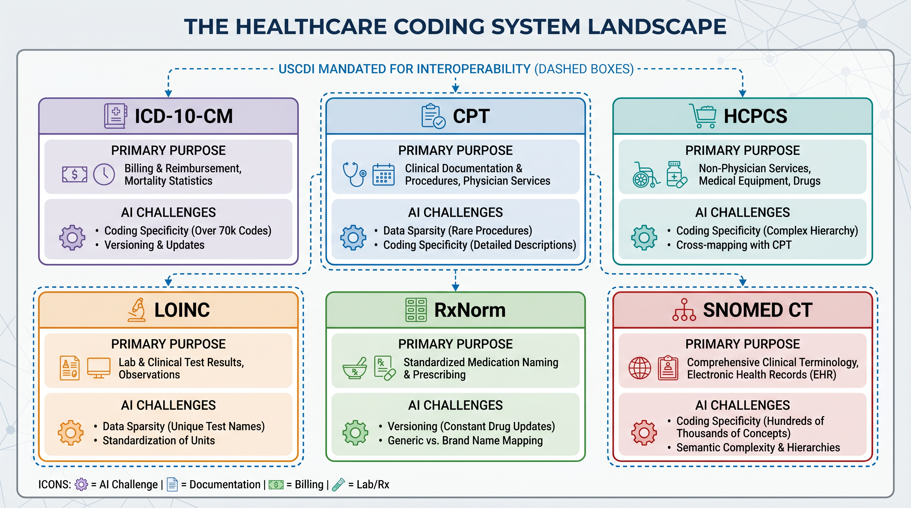
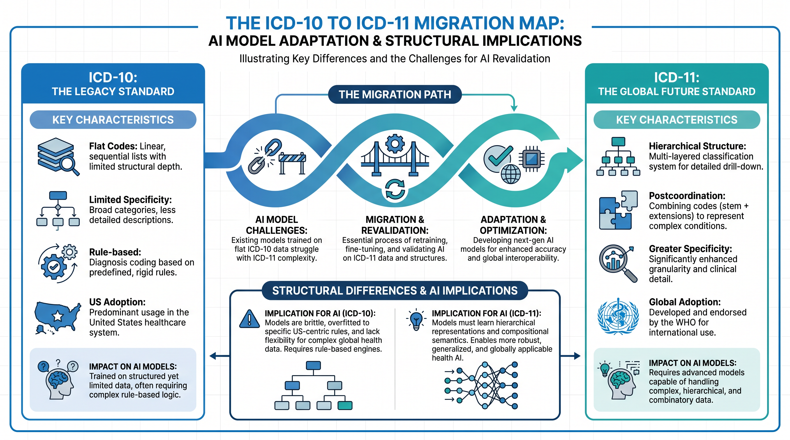
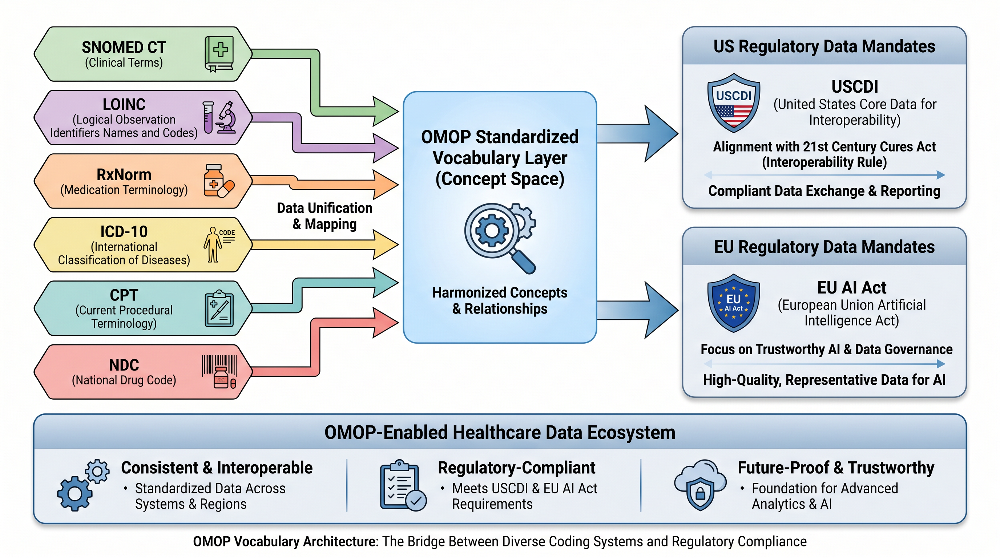
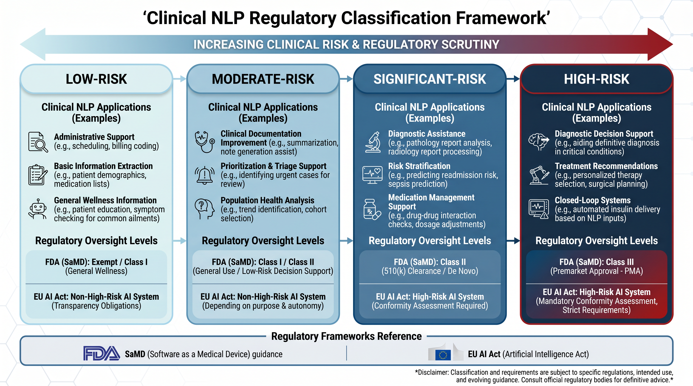

# Chapter 4 — The Semantic Layer

*Coding systems, clinical ontologies, and natural language processing — and why none of it works without regulatory alignment*

> **What This Chapter Covers:** The six major healthcare coding systems and their regulatory purposes · Why the ICD-11 migration matters for every AI model trained on historical data · How OMOP vocabulary aligns with the 21st Century Cures regulatory architecture · Clinical NLP from rule-based systems to foundation models · The FDA SaMD classification spectrum, the **EU AI Act (Regulation (EU) 2024/1689) Annex III** obligations, and the Predetermined Change Control Plan.
>
> **Why It Matters:** An AI system that processes healthcare data without understanding its coding context is not reasoning about health. It is pattern-matching on symbols whose clinical and regulatory meaning it does not know. The semantic layer is what transforms raw coded data into AI-ready knowledge — and regulatory compliance is what determines whether that knowledge can be acted upon in a clinical environment.

---

## Opening: The Gap Between a Code and Its Meaning

Consider a simple laboratory result: 6.8. Without context, this number is meaningless. Is it an HbA1c of 6.8% — a borderline pre-diabetic finding that warrants dietary counseling? A serum creatinine of 6.8 mg/dL — a value indicating severe chronic kidney disease? A pH of 6.8 — a finding that in arterial blood gas interpretation suggests life-threatening acidosis? The number is identical. The clinical interpretation, the downstream action, and the regulatory implications of an AI system that acts on it are entirely different. This is the vocabulary problem at its simplest — and in healthcare data, it repeats itself at scale across millions of observations, thousands of coding concepts, and dozens of partially overlapping classification systems that were each built by a different organization for a different purpose at a different point in time.

The semantic layer is the infrastructure that closes this gap. It is the collection of coding systems, clinical ontologies, natural language processing pipelines, and vocabulary mapping tools that give healthcare data its meaning — that transform a number in a database into a clinical observation with a known concept, a known unit, a known reference range, and a known relationship to every other concept in the clinical knowledge graph. Without the semantic layer, healthcare AI is processing symbols. With it, healthcare AI is processing knowledge. The difference between those two things is the difference between a model that can be validated and a model that can be trusted.

Running through the entire semantic landscape is a regulatory thread that most AI teams do not encounter until they are deep into a deployment — and discover, at considerable cost, that the vocabulary choices they made in their data pipeline have regulatory implications they did not anticipate. The United States Core Data for Interoperability standard mandates specific vocabularies for specific data elements. The 21st Century Cures Act created information blocking rules that require health systems to expose standardized clinical data through FHIR APIs using those vocabularies. The FDA classifies clinical NLP systems on a regulatory spectrum from exempt decision support to Class III Software as a Medical Device. And the **EU AI Act (Regulation (EU) 2024/1689)** designates AI systems used in clinical decision-making as high-risk, with conformity assessment requirements that extend to the quality and standardization of the training data vocabulary. This chapter maps all of it — and then provides the practitioner tools to build on top of it.

> *"An AI system that processes healthcare data without understanding its coding context is not reasoning about health. It is pattern-matching on symbols whose meaning it does not know."*

---

## Topic 1 — The Vocabulary Foundation: Coding Systems, USCDI, CMS Quality Measures, and the ICD-11 Horizon

The healthcare coding system landscape is the product of six decades of independent decisions made by different standards bodies, government agencies, professional associations, and international organizations — each solving a specific administrative or clinical problem, none of them designed to be the foundation of a machine learning training dataset. Understanding what each system was designed to do, what regulatory purpose it serves today, and where it breaks as an AI input is the first competency every healthcare AI practitioner must develop.

*Figure 4.1 — The Healthcare Coding System Landscape. Six major systems, each designed for a different regulatory purpose, each carrying a different AI challenge. USCDI mandates four of them for interoperable data exchange.*

### ICD-10-CM: The Billing Lingua Franca and Its AI Limitations

The International Classification of Diseases, Tenth Revision, Clinical Modification — ICD-10-CM — is the primary diagnosis coding system used in the United States for billing, epidemiological surveillance, and population health analytics. Its approximately 70,000 codes cover the full spectrum of human disease and injury, organized into twenty-two chapters by body system and etiology. For AI systems, ICD-10-CM presents a characteristic challenge: the distribution of code usage is profoundly skewed. A small number of codes — hypertension, diabetes, routine encounters, administrative codes — appear with very high frequency. The vast majority of codes appear rarely, if ever, in any given institution's dataset. This long-tail distribution creates sparsity problems for machine learning models that are particularly acute for rare disease modeling, where the clinical signal is most concentrated in the least frequently observed codes.

The coding conventions of ICD-10-CM introduce a further layer of complexity. The distinction between a principal diagnosis and a secondary diagnosis on a claim reflects both clinical reality and billing optimization strategy. Coding specificity — whether a clinician documents diabetes with peripheral neuropathy as E11.40 or the more specific E11.41, E11.42, or E11.43 — varies by institution, by clinical specialty, and by revenue cycle training. An AI model that does not account for this within-code variation is learning a representation of clinical reality that differs systematically across its training data sources.

### CMS Quality Measure Coding: When Vocabulary Becomes Audit Evidence

The relationship between coding systems and CMS quality measurement programs is one of the most practically important and least well-understood dimensions of healthcare AI. HEDIS measures — the Healthcare Effectiveness Data and Information Set maintained by NCQA — specify precisely which diagnosis codes, procedure codes, and pharmacy codes constitute evidence of care delivery for each measure. The Diabetes Care — HbA1c Testing measure, for example, specifies an exact value set of LOINC codes for qualifying HbA1c laboratory observations, an exact value set of ICD-10-CM codes for qualifying diabetes diagnoses, and an exact specification of the eligible population. An AI system that identifies a care gap using codes outside these value sets is producing an output that cannot be attested in a HEDIS audit — regardless of whether the clinical logic is correct.

The Merit-based Incentive Payment System and the CMS electronic Clinical Quality Measure program extend this principle across the provider reimbursement landscape. eCQMs are expressed in Clinical Quality Language — a formal specification language that references FHIR data elements coded with USCDI-mandated vocabularies. An AI system used for quality improvement that does not align its logic to CQL standards and its coding to USCDI-mandated vocabularies is producing recommendations that cannot be translated into the attestation evidence the quality payment program requires. The vocabulary is not just a technical choice. It is an audit interface.

### The ICD-11 Migration: The Most Consequential Coding Transition in a Generation

The World Health Organization released ICD-11 in 2019 and member states began adopting it from 2022. The United States has not yet adopted ICD-11 for clinical and administrative use — but international AI deployments, global pharmaceutical research, and cross-border health data exchange are already operating in an ICD-11 environment. For healthcare AI teams, the ICD-11 migration is not a distant administrative concern. It is an active model risk.

*Figure 4.2 — The ICD-10 to ICD-11 Migration Map. Structural differences between the two systems create model revalidation obligations for every AI system trained exclusively on ICD-10-coded historical data.*

ICD-11 is architecturally different from ICD-10 in ways that matter deeply for AI. Its postcoordination capability — the ability to combine a stem code with extension codes to express complex clinical concepts — means that the same clinical finding can be legitimately represented in multiple ways, creating a combinatorial space that flat-code AI models were not designed to navigate. Its integration of tumor staging and morphology, its redesigned mental health chapter, and its alignment with SNOMED CT mean that models trained on ICD-10 data will encounter systematic concept-mapping challenges when applied to ICD-11-coded records. The practical implication is straightforward: AI model training pipelines should be designed now with vocabulary version tagging that will enable revalidation against ICD-11-coded data when the transition occurs. Models that cannot trace their training data to specific ICD versions will face revalidation challenges that version-aware pipelines can address systematically.

> **Expert Note — Vocabulary Compliance**
>
> Every AI system consuming or producing healthcare data for regulated clinical use must document which vocabulary version — ICD-10-CM version year, SNOMED CT release date, LOINC version, RxNorm release — its training data was coded against. This is not metadata. It is a regulatory audit requirement under FDA 21 CFR Part 11 and EU AI Act Article 9.

---

## Topic 2 — Ontologies, OMOP, and the 21st Century Cures Architecture

A coding system is a list. An ontology is a knowledge graph. The distinction matters enormously for AI. A system that knows that ICD-10-CM code J18.9 means "Pneumonia, unspecified organism" knows a label. A system that understands the SNOMED CT concept hierarchy knows that pneumonia is a type of lower respiratory tract infection, which is a type of respiratory system finding, which can be caused by bacterial, viral, or fungal organisms, and that the finding site is the lung — and it can traverse these relationships to reason about clinical concepts in ways that flat-code systems cannot. Ontological reasoning is the capability that separates healthcare AI systems that understand clinical knowledge from those that have memorized clinical patterns.

*Figure 4.3 — OMOP Vocabulary Architecture and 21st Century Cures Alignment. The OMOP standardized vocabulary layer unifies six major coding systems into a single concept space — and aligns with every major US and EU regulatory data mandate.*

### SNOMED CT: The Ontological Foundation of Clinical AI

SNOMED CT — the Systematized Nomenclature of Medicine Clinical Terms — is the most comprehensive clinical ontology in existence. Its approximately 350,000 concepts are connected by over one million relationships organized into multiple hierarchy types. The Is-a relationship defines taxonomic hierarchy — bacterial pneumonia is a type of pneumonia. The Finding site relationship connects clinical findings to anatomical locations — pneumonia has a finding site of lung structure. The Causative agent relationship connects infectious diseases to their pathogens. The Associated morphology relationship connects pathological findings to their structural manifestations. These relationships enable a class of AI capability that ICD-10-coded data alone cannot support: hierarchical generalization, where a model trained on specific pneumonia subtypes can correctly generalize to the pneumonia concept, and epidemiological roll-up, where population health queries can aggregate all respiratory infections regardless of the specific coding used to document them.

SNOMED CT's regulatory role is expanding significantly. The ONC's USCDI standard mandates SNOMED CT for the problems list data element in FHIR-based clinical data exchange. The 21st Century Cures Act's information blocking provisions require covered entities to respond to patient data requests using USCDI-compliant FHIR APIs — which means that any AI system consuming FHIR data from a compliant health system should expect SNOMED CT-coded problem lists. This is a regulatory trajectory healthcare AI teams must design toward, not around.

### OMOP: The Vocabulary Unification Layer

The OMOP Common Data Model does not just standardize the structure of healthcare data. It standardizes the vocabulary. Every concept in an OMOP database — every diagnosis, every procedure, every laboratory observation, every drug exposure — is mapped to a standard concept in the OMOP Standardized Vocabularies, a unified concept space that encompasses SNOMED CT, LOINC, RxNorm, ICD-10, CPT, and over fifty additional source vocabularies. A diagnosis coded as ICD-10-CM E11.9 in the source data becomes SNOMED CT concept 44054006 — Diabetes mellitus type 2 — in the OMOP standardized representation. A laboratory result coded with a local hospital lab code becomes a LOINC-coded OMOP Measurement. This mapping process — the ETL from raw clinical data to OMOP — is labor-intensive and requires domain expertise. But the result is a dataset where every concept is expressed in a standard vocabulary that is consistent across institutions, consistent across time, and aligned with the regulatory mandates that govern clinical data exchange.

The EU AI Act adds a further dimension to the OMOP vocabulary argument. Article 9 of the Act requires that high-risk AI systems — which include clinical decision support systems under Annex III — be trained on data that is relevant, sufficiently representative, and free of errors to the extent possible. For a clinical NLP system trained on data from multiple institutions with different local coding practices, OMOP ETL to a standardized vocabulary is one of the most defensible ways to demonstrate representativeness and consistency to a conformity assessment body. It is not the only way — but it is the one that aligns most directly with the regulatory trajectory of both US and EU healthcare data governance.

> **Expert Note — OMOP as Regulatory Strategy**
>
> Investing in OMOP ETL infrastructure is not just a research data management decision. It is a regulatory alignment strategy that positions an AI system to meet USCDI interoperability requirements, EU AI Act training data quality obligations, and FDA audit trail requirements simultaneously. The organizations that build OMOP pipelines now are building the regulatory defensibility of their AI systems at the same time.

---

## Topic 3 — Clinical NLP, FDA Guidance, EU AI Act Classification, and the Foundation Model Accountability Question

Between sixty and seventy percent of clinically relevant information in a patient record exists only in unstructured text. The physician narrative that describes how a patient presented, the uncertainty that a clinician expressed about a differential diagnosis, the social history that explains why a patient has not been adherent to their medication regimen, the radiology report that characterizes the morphology of a finding in language that no structured field was designed to hold — all of this lives in free text. Clinical natural language processing is the discipline that extracts structured, coded meaning from this text. And it is the area of healthcare AI where the gap between technical capability and regulatory clarity is currently the widest.

*Figure 4.4 — Clinical NLP Regulatory Classification Framework. The FDA SaMD spectrum, the 21st Century Cures CDS exemption test, EU AI Act Annex III obligations, and the Predetermined Change Control Plan — four regulatory frameworks every clinical NLP deployment must navigate.*

### The Clinical NLP Landscape: From Rules to Foundation Models

Clinical NLP has evolved through three distinct generations. The first generation — rule-based systems like Apache cTAKES and MedTagger — extracts clinical entities by matching text against hand-crafted dictionaries and applying rule-based logic for negation, temporality, and uncertainty. These systems are interpretable, auditable, and predictable in their behavior — properties that are valuable in regulated environments. They are also brittle, expensive to maintain, and limited in their coverage of the variability of clinical language as it is actually written. The second generation — machine learning systems trained on annotated clinical corpora — dramatically improved coverage and robustness at the cost of interpretability. Systems like MetaMap and early BERT-based models could generalize across clinical language variations that rule-based systems could not handle, but their internal reasoning was substantially less transparent.

The third generation — clinical foundation models — represents the most significant capability advance and the most complex regulatory challenge simultaneously. PubMedBERT, trained on the entire PubMed abstract corpus, arrives with deep statistical knowledge of biomedical language embedded in its weights. ClinicalBERT and its variants, fine-tuned on MIMIC clinical notes, understand the specific conventions of clinical documentation — the abbreviations, the shorthand, the disease-specific terminology — that general-purpose language models do not. Med-PaLM 2, Google's medical foundation model, demonstrated expert-level performance on clinical question answering benchmarks that represent real clinical decision challenges. These models are extraordinarily capable. They are also trained on data whose provenance, consent status, and regulatory compliance cannot always be fully established — a fact that becomes directly relevant when a foundation model-based NLP system seeks regulatory clearance.

### The FDA SaMD Classification Question

The FDA's regulatory framework for clinical NLP systems is not a simple binary between regulated and unregulated. It is a spectrum defined by intended use, clinical context, and the degree to which the system's output replaces rather than supports clinician judgment. The 21st Century Cures Act created a specific exemption for clinical decision support software that meets four criteria simultaneously: it does not acquire, process, or analyze medical images or signals; it displays only clinical reference information or evidence-based guidelines; it does not replace clinical judgment; and a clinician can independently review the underlying logic. NLP systems that extract diagnoses from clinical notes and use those extractions to trigger care management outreach, to populate quality measure denominators, or to influence prior authorization decisions are almost certainly not meeting criteria two and three of this exemption test. They are influencing clinical decisions based on automated text extraction — and that places them firmly in the SaMD classification question.

The FDA's 2021 AI/ML-based SaMD Action Plan, and the subsequent discussion papers on generative AI in medical devices, trace a regulatory trajectory moving toward greater specificity about what clinical AI must demonstrate before deployment. The intended use statement is the document that determines where on the regulatory spectrum a clinical NLP system falls — and it must be written before the system is designed, not after it is deployed. An NLP system intended to extract diagnoses for research registry population sits in a different regulatory space than one intended to extract diagnoses for clinical alert triggering. The technical implementation may be identical. The regulatory pathway is entirely different. Healthcare AI teams that treat the intended use statement as a documentation exercise rather than an architectural decision are building regulatory risk into the foundation of their systems.

### The EU AI Act: High-Risk by Definition

For European market deployments, the regulatory question is substantially less ambiguous. The EU AI Act's Annex III designates AI systems intended to be used for making decisions or assisting in making decisions in the health and safety domains as high-risk. Clinical NLP systems used to support diagnosis, treatment recommendation, triage, or clinical alert generation fall squarely within this designation. The conformity assessment requirements that follow are substantial. Technical documentation must demonstrate that the training data was relevant, sufficiently representative, and adequately annotated. Human oversight measures must be designed into the system — not bolted on after deployment. Accuracy, robustness, and cybersecurity requirements must be met and documented. And the system must provide transparency to users about its capabilities and limitations in language that enables informed clinical judgment.

For healthcare AI teams developing systems for both US and EU markets, the EU AI Act conformity requirements create a useful design discipline. Meeting them requires exactly the kind of rigorous training data documentation, validation methodology specification, and human oversight design that the FDA's evolving SaMD guidance is moving toward — but has not yet fully mandated. Organizations that build to EU AI Act standards for their clinical NLP systems are, effectively, building ahead of where US regulatory requirements are heading. That is a regulatory risk management strategy, not just a compliance exercise.

### The Predetermined Change Control Plan: Making Continuous Learning Regulatory-Compatible

Foundation models do not stay static. They are retrained as new data becomes available, fine-tuned as clinical language evolves, and updated as downstream validation studies reveal performance gaps. In a traditional regulatory framework, each substantive change to a cleared medical device software system requires a new regulatory submission — a process that can take months and creates a powerful disincentive to model improvement that serves neither patients nor regulators. The FDA's Predetermined Change Control Plan is the mechanism designed to resolve this tension.

A PCCP is a document submitted with the initial regulatory filing that specifies in advance the types of model changes that are permitted without requiring a new submission, the performance bounds within which those changes must remain, the validation methodology that will be applied to each permitted change type, and the monitoring protocol that will detect when a change has caused the system to drift outside its specified performance envelope. For clinical NLP systems built on foundation models, designing the PCCP before the first regulatory submission is not optional — it is the architecture decision that determines whether continuous model improvement is compatible with regulatory oversight over the lifetime of the product. A clinical NLP system deployed without a PCCP strategy will face a regulatory interaction every time its foundation model is updated. With a well-designed PCCP, those updates become a managed, documented, and pre-approved part of the product lifecycle.

> **Expert Note — PCCP Design Principle**
>
> Every clinical NLP system built on a foundation model should have a Predetermined Change Control Plan designed before its first regulatory submission. The PCCP is not a regulatory burden — it is the architecture that makes continuous model improvement compatible with patient safety. Design it early, design it specifically, and treat it as a living document that evolves with the system it governs.

---

## Chapter Close: The Semantic Layer as the Bridge Between Data and Trust

The semantic layer is not glamorous infrastructure. Coding system mappings, ontology traversals, vocabulary version management, and NLP pipeline validation do not appear in conference keynotes or investor presentations. But every healthcare AI system that reaches clinical deployment — every model that influences a care management decision, surfaces a diagnostic insight, or closes a care gap — depends on a semantic layer that correctly interprets the coded data it processes. The organizations that invest in this layer carefully, that align their vocabulary choices to regulatory mandates before they are required to, that design their NLP systems with FDA classification and EU AI Act conformity in mind from the first architecture decision, are the ones that build systems that can be deployed, validated, and trusted in environments where the stakes of getting the interpretation wrong are measured in clinical outcomes.

Chapter 5 takes the foundation established across Chapters 1 through 4 — the regulatory reality, the sector anatomy, the data landscape, and the semantic layer — and examines the AI model landscape itself: the architectures, the training strategies, and the evaluation frameworks that healthcare AI practitioners are deploying against these foundations. The data is now understood. The meaning is now interpretable. The question that remains is what kinds of models, built in what ways, with what validation obligations, can actually be trusted to act on what the data means.

> *"The semantic layer is what transforms raw coded data into AI-ready knowledge — and regulatory compliance is what determines whether that knowledge can be acted upon in a clinical environment."*

---

## For Practitioners

Technical readers: a companion **[Practitioner Depth](practitioner.md)** page accompanies this chapter — regulatory data snapshots plus runnable, Colab-ready code.

---

*Chapter 4 · Preview edition. The complete book is in progress — [share feedback](https://github.com/zkumar/healthcare-ai-book-preview/issues).*
