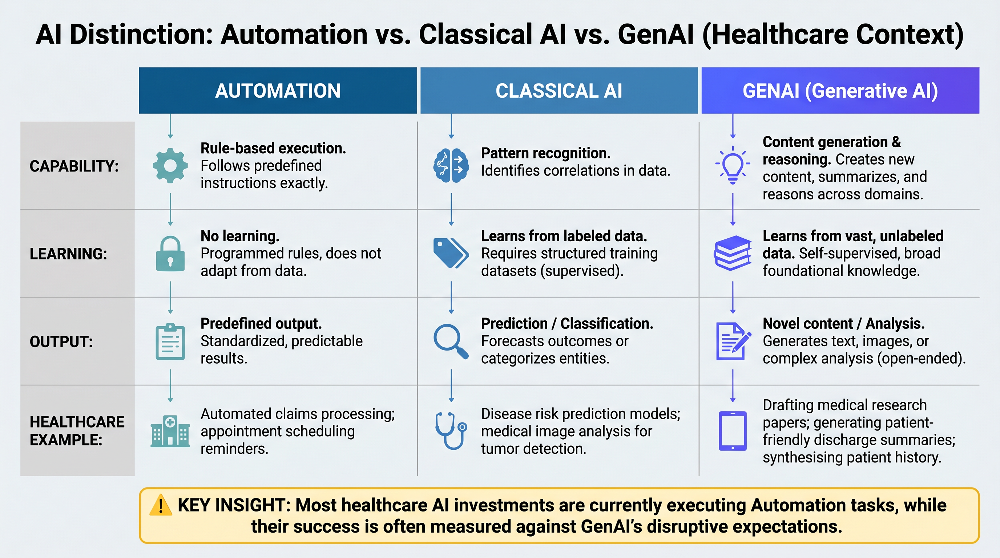
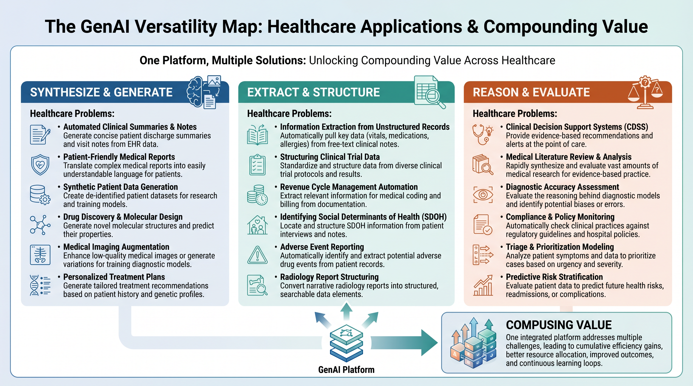
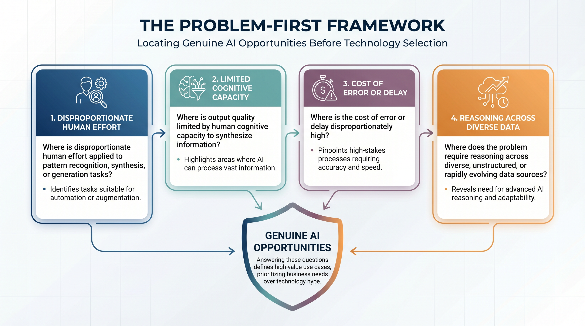
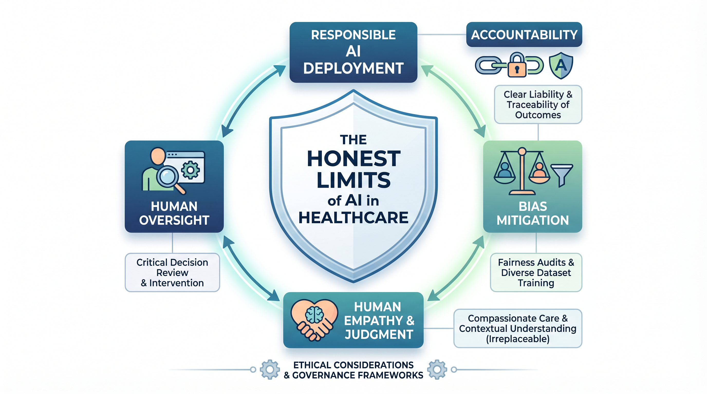

# Chapter 5 — What AI Can and Cannot Do

*The mental model reset that every healthcare executive, clinician, and engineer needs before deploying anything*

> **What This Chapter Covers:** The critical distinction between automation, classical AI, and GenAI · Why wrong focus produces wrong results and how the versatility gap explains most healthcare AI disappointments · The problem-first framework for locating genuine AI opportunity · The honest limits that every responsible healthcare AI deployment must respect.
>
> **Why It Matters:** This is the chapter that changes how you read every chapter that follows. Before examining what AI does in MedTech, payer operations, clinical settings, and drug discovery, you need a clear mental model of what AI actually is — what it can do that nothing else can, where its versatility is being systematically underestimated, and where its limits are being systematically ignored. Without this mental model, the domain chapters are interesting. With it, they become actionable.

---

## Opening: The Most Expensive Misunderstanding in Healthcare Technology

There is a conversation that plays out, with remarkable consistency, across healthcare organizations of every size and type. An executive team decides to invest in AI. A vendor is selected, a pilot is launched, expectations are set. Twelve months later the pilot has produced results that are technically defensible and operationally disappointing. The model works. The problem it was applied to was not the right one. The capability that was deployed was a fraction of what was available. And the organization concludes, incorrectly, that AI has underdelivered — when what actually happened is that the wrong problem was given to the right tool, or the right problem was given to the wrong category of tool entirely, or a genuinely powerful platform capability was deployed as a point solution against a narrow use case while fifteen adjacent opportunities went unaddressed.

This pattern has a name. It is wrong focus producing wrong results. And it is the most expensive misunderstanding in healthcare technology today — not because AI is overhyped, but because the mental model that most healthcare professionals carry into their first AI engagement is too narrow, too imprecise, and too easily confused between three fundamentally different categories of capability: rule-based automation, classical machine learning, and generative AI. These are not the same thing. They do not do the same things. They do not fail in the same ways. An organization that deploys automation while calling it AI, or deploys a classical ML model where a generative system would have been transformative, or deploys a point solution where a platform would have compounded value across a dozen workflows simultaneously, is not making an implementation error. It is making a strategic error — one that compounds with every subsequent decision built on the same misunderstanding.

This chapter draws the lines clearly. It does not require technical depth to follow — it requires intellectual honesty about what has been purchased, what has been deployed, and what has actually been asked of the tools that healthcare organizations are calling AI. The regulators have already made many of the relevant distinctions: the FDA's AI/ML Software as a Medical Device Action Plan (FDA 2021a) and its subsequent guidance trail; the World Health Organization's ethics and governance framework (WHO 2021); and the EU AI Act's high-risk classification of clinical decision-making AI (Regulation (EU) 2024/1689) — each describes a category-aware view of AI that this chapter argues healthcare organizations must internalize before any procurement decision. By the end of it, the reader will have a mental model that changes how they evaluate every AI investment, every vendor claim, and every deployment decision in the domain chapters that follow.

> *"Wrong focus produces wrong results — not because the AI failed, but because the problem it was given was not the one where it would have created the most value."*

---

## Topic 1 — Drawing the Line: Automation, Classical AI, and GenAI

Walk into almost any healthcare organization today and ask where they are using AI. The answers will include rule-based prior authorization logic — if the diagnosis code matches this list and the procedure code matches that list and the member has not had this procedure in the past twelve months, approve. Deterministic claims editing systems — if the modifier is incompatible with this procedure code, reject. Scheduled population health reports — pull all members with HbA1c over nine who have not had a retinal exam in the past year and generate an outreach list. Alert-driven clinical decision support — if the creatinine exceeds this threshold for a patient on this medication, fire an alert. None of these are AI. They are automation — valuable, important, well-understood automation that healthcare could not function without. But they are systems that execute predefined logic on structured inputs and produce predefined outputs when conditions are met. They do not learn. They do not generalize. They do not improve with exposure to new cases. They do exactly what they were programmed to do, and nothing more.

*Figure 5.1 — Automation · Classical AI · GenAI: The Distinction Matrix. Most healthcare AI investments are executing column one tasks while being measured on column three expectations. That gap is where strategy fails.*

The confusion between automation and AI is not semantic pedantry. It produces real organizational harm in three specific ways. First, it miscalibrates investment. An organization that classifies its rules engine as AI will evaluate its AI portfolio against the performance of a rules engine — and will miss the question of what a genuinely intelligent system would have been able to do with the same data and the same operational context. Second, it miscalibrates expectations. When the rules engine performs exactly as designed — correctly executing its rules, failing on anything outside them — the organization experiences this as AI performance and draws conclusions about AI capability that are systematically too low. Third, it displaces investment. Every dollar spent maintaining a rules engine that is classified as AI is a dollar not spent on the genuine AI capability that could be transforming the underlying workflow.

### Classical Machine Learning: The Middle Layer

Classical machine learning — logistic regression, gradient boosting, random forests, convolutional neural networks for imaging — occupies a genuinely different category from automation. These systems identify statistical patterns in historical data that were not explicitly programmed by a human. A readmission prediction model trained on claims and EHR data is discovering, from the data itself, which combinations of diagnosis codes, procedure history, demographic characteristics, and utilization patterns are associated with thirty-day readmission — patterns that no rule-writer programmed and that may not be visible to human inspection of the training data. This is real machine learning. It learns. It generalizes within the distribution of its training data. It produces outputs that reflect genuine statistical inference rather than predetermined logic.

But classical ML has a characteristic boundary that matters enormously for understanding where GenAI adds something genuinely new. Classical ML models learn from labeled examples of a specific task and produce outputs in the form defined by their training objective. A readmission model predicts readmission probability. A diagnostic imaging model classifies images into predefined categories. A fraud detection model scores claims for anomaly likelihood. These are powerful capabilities — but they are narrow ones. Each model does one thing, requires task-specific labeled training data, and fails gracefully but completely when presented with tasks it was not trained for. The readmission model cannot explain its prediction in natural language. The imaging classifier cannot read the clinical note that accompanies the image. The fraud model cannot generate the audit narrative that a payment integrity analyst needs to act on its findings.

### GenAI: The Versatility That Changes the Equation

Generative AI — foundation models of the scale and capability represented by GPT-4 class systems, Claude, Llama, and their successors — adds something that neither automation nor classical ML could provide: the ability to reason across tasks, synthesize across sources, generate language, and operate in novel contexts without task-specific retraining. A well-prompted foundation model can read a clinical note and extract structured diagnoses. It can then evaluate those diagnoses against a prior authorization criteria set. It can then generate the clinical argument for coverage in the specific language style the payer expects. It can then flag the documentation gaps in the physician note that are most likely to trigger a denial and suggest the specific additional documentation that would strengthen the submission. None of these steps require retraining. None require a separate model. All of them reflect the same underlying reasoning capability applied to connected steps in a real operational workflow. That is what versatility means in practice — and it is what most healthcare organizations have not yet understood about the tools they are now beginning to deploy.

### Prior-Auth Appeals: One Problem, Three Handlings

Make the distinction concrete by following a single workflow — the prior-authorization appeal — through each category. A payer denies coverage for a procedure. The clinician's office disputes the denial. Three different systems can intervene, and the difference between them is the entire argument of this chapter.

**Automation** routes the appeal to a queue based on diagnosis code, attaches the standard template, and rejects appeals where the original denial reason matches a list of non-appealable codes. Coverage is structural: it works exactly where the rules say it works, and not one workflow further. The appeal letter, if generated at all, is a fill-in-the-blanks template — clinically inert and indistinguishable across cases.

**Classical machine learning** adds prediction. A model trained on historical appeals scores incoming cases by overturn probability, surfacing the highest-yield appeals first so the human team works the cases most likely to win. The model does not draft the letter. It does not read the clinical packet. It optimizes the queue. The synthesis, the writing, and the documentation strategy still belong to the appeals team — the model has improved their throughput, not their reach.

**Generative AI** does the synthesis itself. The same foundation model reads the twelve-page clinical packet, locates the documentation gap that triggered the denial, identifies the specific clinical guideline that supports overturn, drafts the appeal letter in the payer's expected style, and flags what the physician should add to the chart to strengthen future submissions of the same type. The same model — without retraining — also handles CAPA root-cause narratives, IFU translation, EOB explanations, and post-acute discharge summaries. One platform investment, fifteen workflows.

The wrong-focus trap is now visible. The organization that deploys a foundation model as an automation replacement — using it to fill in template fields — has bought a platform and is using it as a rules engine. The right cost frame is not *"the AI did the task"* but *"the AI did the task that no narrower tool could have done at all"*.

> **Expert Note — Strategic Distinction**
>
> Automation replaces a process step. Classical ML improves a prediction. GenAI transforms a workflow. Organizations that are using GenAI to replace process steps are getting automation-level value from a platform-level investment. The opportunity cost of that misapplication is the gap between what they are measuring and what they could have built.

---

## Topic 2 — The Versatility Gap: How Wrong Focus Produces Wrong Results

The versatility gap is the distance between what an organization thinks AI can do and what it actually can do. It is the single largest source of unrealized healthcare AI value in the market today. And it is maintained, almost entirely, by a mental model of AI that was formed before foundation models existed and that has not been updated to reflect what the current generation of AI systems is actually capable of.

The mental model problem manifests in a specific and consistent pattern. An organization enters an AI initiative with a use case in mind — a chatbot for patient questions, or a summarization tool for clinical notes, or a risk score for readmission prediction. They deploy. They measure. They find that the tool does what it was asked to do with reasonable accuracy. They declare the AI initiative a success and move on. What they do not do — what the wrong-focus pattern systematically prevents — is ask the next question: given what we now understand about this tool's capability, what else could it be doing that we have not yet asked it to do?

*Figure 5.2 — The GenAI Versatility Map. Three capability modes — synthesize and generate, extract and structure, reason and evaluate — each mapping to five or more distinct healthcare problems. One platform, fifteen problems, compounding value.*

The versatility map illustrates something that is immediately obvious once it is drawn but genuinely non-obvious before. Generating a multilingual IFU for a medical device, writing a CAPA root cause analysis from complaint data, drafting a prior authorization appeal letter, and producing a population health narrative for a board presentation are not four different AI problems requiring four different AI systems. They are four instances of the same underlying capability: synthesizing structured knowledge and regulatory or clinical context into coherent, accurate, audience-appropriate documents under specific constraints. A healthcare organization that builds four separate AI tools for these four workflows is spending four times the budget, incurring four times the maintenance burden, and governing four separate systems — when a single platform deployment, properly designed and governed, would have served all four workflows and been extensible to twelve more.

Two public cases make the wrong-focus pattern concrete at scale. **IBM Watson for Oncology** was a billion-dollar bet on AI for cancer treatment recommendations — deployed against a problem class (synthesizing across heterogeneous oncology evidence into patient-specific recommendations) where the architecture mismatch was structural rather than refinable. Internal documents reviewed by investigative reporters revealed instances of "unsafe and incorrect" treatment recommendations (Ross & Swetlitz 2018), and a longer post-mortem traced the program's commercial collapse to a mismatch between marketing claims and the system's actual technical reach (Strickland 2019). The well-rehearsed retrospective is not that AI had been oversold. It is that the wrong category of AI had been applied to a problem that needed a fundamentally different shape of intelligence than the system could provide. The **Epic Sepsis Model** offers a smaller-scale version of the same lesson with cleaner data. A classical-ML prediction model, internally validated and widely deployed across health systems, performed substantially worse on external validation than its internal benchmarks suggested — sensitivity of 0.33 at the recommended threshold, with the model failing to identify the majority of sepsis cases (Wong et al. 2021). The failure was not statistical. A narrow classifier of *"will this patient develop sepsis"* did not capture the operational and informational context in which the alert had to be acted upon — clinicians overrode it, missed cases continued, and the model's stated performance was not the performance the organization was experiencing. Both are wrong-focus failures. Both are also avoidable by the discipline that follows.

### The Problem-First Framework

The antidote to wrong focus is a discipline that sounds simple and proves surprisingly difficult to practice consistently: start with the pain, not the technology. Before any AI architecture discussion, before any vendor selection, before any pilot design, the organization must be able to answer four diagnostic questions with precision and honesty.

*Figure 5.3 — The Problem-First Framework. Four diagnostic questions that locate genuine AI opportunity before any technology selection occurs. The answers narrow the solution space more reliably than any capability survey.*

The first question asks where disproportionate human effort is being applied to tasks that are fundamentally about pattern recognition, synthesis, or generation rather than physical action or relationship. A prior authorization clinical reviewer reading twelve-page clinical packages to determine whether three criteria are met is performing pattern recognition and synthesis at high volume and high cost. That is a signal. A compliance team manually reviewing device change documentation to assess IEC 62304 change control impact is applying complex regulatory knowledge to specific cases at a pace determined by human reading speed. That is a signal. A billing team generating explanation-of-benefits narratives for complex claims is performing document generation under structured constraints. That is a signal. Each of these signals points to a workflow where GenAI can operate at the speed and scale that human teams cannot — not by replacing clinical judgment, but by handling the cognitive volume that currently absorbs the time that clinical and regulatory professionals should be spending on the genuinely complex decisions that require their expertise.

The second question asks where output quality is limited by the volume of information that humans can realistically synthesize within the time available for a decision. Population health risk stratification that incorporates claims history, lab trends, pharmacy adherence, wearable biometric signals, and social determinants of health simultaneously is a synthesis task that exceeds the cognitive capacity of any human analyst working against a weekly outreach list. A post-settlement claims audit that cross-references the original authorization, the 837 claim, the 835 remittance, the clinical documentation, and the payer contract payment rules across thousands of claims simultaneously is a synthesis task that human audit teams perform on samples rather than populations because the full-population version is humanly impossible. GenAI makes the full-population version tractable. The question is whether the organization is asking it.

The third and fourth questions identify where data is being collected without being acted upon due to human bandwidth limits, and where wrong focus is already producing wrong results in current AI investments. Together, the four questions produce a map of genuine AI opportunity that is grounded in operational reality rather than technology enthusiasm — and that reliably surfaces the workflows where a platform AI investment will create compounding value rather than isolated point-solution results.

> **Expert Note — The Platform Principle**
>
> Every healthcare AI investment should be evaluated not just on its performance in its primary use case, but on the number of adjacent workflows it can address from the same platform foundation. A point solution that solves one problem at full cost is almost always a worse investment than a platform that solves twelve problems at incremental cost. The organizations that understand this are building AI strategies. The ones that do not are building AI portfolios.

---

## Topic 3 — The Honest Limits: What AI Cannot Do, Fix, or Be Accountable For

Versatility without honesty about limits produces the most expensive failures in healthcare AI. The organizations that deploy AI with a clear-eyed understanding of what it cannot do are the ones that design their systems with appropriate human oversight, appropriate governance infrastructure, and appropriate risk management. The ones that deploy it without that understanding are the ones that discover the limits at the worst possible moment — in production, at scale, in a clinical environment where the consequences of getting it wrong are measured in patient outcomes and institutional trust.

*Figure 5.4 — The Honest Limits. Four categories of genuine AI limitation that every healthcare deployment must address in its design, its governance, and its risk management documentation.*

### Hallucination: The Confident Wrong Answer

Hallucination is the most discussed limitation of generative AI — and it deserves its prominence. A language model that generates a confident, fluent, factually incorrect clinical rationale is not producing an obvious error. It is producing an output that looks exactly like a correct output — well-structured, professionally written, internally consistent, and wrong in ways that are difficult to detect without independent verification of the underlying facts. In a non-clinical context, this is an inconvenience. In a clinical context, it is a patient safety event waiting to happen. A prior authorization appeal letter that cites a clinical guideline that does not say what the model claims it says. A CAPA root cause analysis that references a regulatory requirement incorrectly. A multilingual IFU that introduces a subtle translation error that alters the clinical meaning of a safety instruction. Each of these is a hallucination failure mode that is specific to healthcare deployment and that must appear in the system's ISO 14971 risk register as an identified hazard with documented risk control measures.

The mitigation strategies for hallucination in healthcare AI are well-established and must be built into the architecture rather than added as afterthoughts. Retrieval-augmented generation — grounding model outputs in verified source documents rather than allowing free generation from model weights alone — dramatically reduces hallucination rates for factual content (Lewis et al. 2020). Human review gates at clinically significant output points ensure that no AI-generated clinical or regulatory content reaches consequential use without expert verification — a principle explicitly enumerated as one of the ten Good Machine Learning Practice (GMLP) Guiding Principles published jointly by the FDA, Health Canada, and the UK MHRA (FDA, Health Canada & MHRA 2021). Factual grounding validation — systematic comparison of model outputs against authoritative sources — provides a quality control layer that can be audited and documented. None of these mitigations eliminate hallucination risk entirely. All of them reduce it to a level that can be managed within a properly designed risk framework.

The cost of skipping these mitigations is concrete: an AI-drafted appeal letter that cites a clinical guideline which does not say what the model claims; the payer rejection that follows on grounds of factual inaccuracy; the six-week surgical delay while the appeal is reworked manually. The hallucination is not a model error. It is a deployment failure that an architectural decision could have prevented.

### Accountability: The Line That Cannot Be Crossed

AI cannot bear legal, regulatory, or professional accountability for the decisions it influences. This is not a temporary limitation of current technology — it is a structural property of AI systems that will not change with capability improvements. The clinician who acts on an AI diagnostic recommendation is responsible for that clinical decision, regardless of how the AI framed its confidence. The regulatory affairs professional who releases a device label containing AI-generated content without independent expert review is personally and institutionally accountable for that label's accuracy and compliance. The payer analyst who initiates a recoupment action based solely on an AI audit output, without reviewing the underlying clinical and claims documentation, is making a business decision for which the organization is legally accountable and for which the AI bears none.

This accountability boundary must be designed into every healthcare AI system from the first architecture decision. The intended use statement must specify that the system is decision support, not decision replacement — a distinction the FDA codified in its Clinical Decision Support guidance, where systems whose recommendations the clinician cannot meaningfully review or override are reclassified as the device itself (FDA 2022). The human-in-the-loop design must be genuine — not performative oversight where a human clicks approve on AI outputs without meaningful review, but substantive engagement where the human reviewer has the information, the time, and the authority to override the AI output when their judgment differs. The EU AI Act formalizes this requirement at Article 14: high-risk AI systems must be designed so that natural persons can effectively oversee them, including the ability to "decide, in any particular situation, not to use the high-risk AI system or otherwise disregard, override or reverse the output" (Regulation (EU) 2024/1689). The audit trail must document both the AI output and the human decision that followed it, because in any subsequent regulatory or legal proceeding, it is the human decision that will be examined, and the AI output that will be context.

The pattern fails the moment the human becomes a button-pusher. A care manager who approves AI-flagged denials in batch without opening the record; a regulatory submission that includes AI-generated risk-benefit language without independent review; an audit recoupment based on an AI score with no underlying chart review. In each case, accountability does not disappear. It concentrates on the person who signed the output — and that person is rarely the one who deployed the model.

### Clinical Judgment: The Irreducible Human Element

There is a category of clinical decision-making that AI cannot perform — not because it lacks the information processing capability, but because the decision is not fundamentally about information processing. It is about integrating clinical evidence with a specific patient's values, fears, cultural context, social circumstances, and preferences for how they want to live their life — a synthesis that requires a human relationship and a human conversation that no AI system can substitute for. The patient with Stage III cancer who, when presented with two treatment options of roughly equivalent survival probability, chooses the one with lower efficacy but less impact on her ability to care for her children — that decision cannot be optimized by an AI system. The elderly patient with multiple comorbidities who declines the intervention that clinical evidence supports because his values prioritize quality of life over quantity — that conversation cannot be delegated to an AI agent. AI can surface the evidence, present the options, flag the tradeoffs, and document the discussion. The judgment is the clinician's, and the relationship in which that judgment is exercised is irreplaceable.

Designs that ignore this produce predictable failure. AI-routed care management scores the patient as low-risk because she has not utilized care, missing the reason she has not utilized care. AI-generated discharge education addresses the diagnosis correctly and the patient's actual literacy, language, and home circumstances not at all. In both cases the model is performing exactly what it was designed to perform; the deployment failed to recognize what it was not designed to perform.

### Broken Foundations: The Limit That Surprises the Most

Of the four honest limits, this is the one that surprises organizations most — because it is not a limit of the AI itself but a limit of what the AI can do when the environment it is deployed into is not ready for it. AI cannot fix a broken data environment by being smart enough to work around it. A foundation model deployed on top of fragmented, inconsistently coded, poorly governed clinical data will produce outputs that are coherent, fluent, and wrong in ways that are harder to detect than the original data quality problem — because the model's linguistic fluency creates an appearance of reliability that the underlying data does not support. The pattern repeats further upstream, in the data itself: a widely used commercial risk-scoring algorithm was found to systematically under-prioritize Black patients for high-risk care management because it used historical healthcare *spending* as a proxy for healthcare *need* — patients who had been spent on less were classified as needing less, a bias inherited from the data, not invented by the model (Obermeyer et al. 2019). The bias travels regardless of how capable the downstream model is. The pulse-oximeter case is even more concrete: devices calibrated predominantly on lighter-skinned populations under-detect hypoxemia in Black patients at nearly three times the rate of white patients (Sjoding et al. 2020) — an AI system that ingests that signal cannot reason its way around the sensor that produced it. In practice this is a foundation model deployed across three EHRs whose problem lists code *diabetes* five different ways, producing population-health summaries that read fluent and are systematically wrong about prevalence — coherent failure that is harder to catch than the underlying data problem it was meant to surface. AI cannot fix a broken process by automating the broken steps faster. A prior authorization workflow with a fundamental design flaw will be a prior authorization workflow with the same fundamental design flaw executing at higher volume if AI is layered on top of it without redesigning the process. And AI cannot fix a governance problem by being capable enough to work without accountability infrastructure. No model, however powerful, compensates for the absence of the data quality framework, the consent management system, the audit trail, and the human oversight design that responsible healthcare AI deployment requires.

> **Expert Note — The Foundation Rule**
>
> Before deploying AI on any healthcare workflow, the organization must be able to answer three questions honestly. Is the data that will feed this system of sufficient quality, consistency, and governance to support the outputs it will generate? Is the process that AI will participate in designed correctly, or is it being automated in its current broken state? And is the governance infrastructure — audit trails, human oversight, accountability documentation — in place before the first AI output reaches a clinical or operational decision? If the answer to any of these is no, the AI deployment should wait. Building on a broken foundation produces coherent, fluent, expensive failure.

---

## Chapter Close: The Mental Model That Travels

The distinction between automation, classical AI, and GenAI. The versatility gap and the wrong-focus trap. The problem-first framework that locates genuine opportunity. The honest limits that every responsible deployment must respect. These four ideas constitute the mental model that every subsequent chapter in this book assumes. They are not academic concepts — they are operational tools. The reader who carries them into the MedTech chapter will ask different questions about CAPA automation and IFU generation than the reader who does not. The reader who carries them into the payer chapter will see the claims audit architecture and the population health stratification system differently. And the reader who carries the honest limits into every deployment decision they make will build systems that earn and keep the trust of the clinicians, regulators, administrators, and patients they are designed to serve.

Part II of this book applies these tools to the specific operational domains where healthcare AI is being built and deployed right now. Chapter 6 opens with MedTech — the domain where regulated software and clinical intelligence converge, and where AI is beginning to transform the product lifecycle from concept to post-market surveillance. The problems are real. The architectures are specific. The regulatory constraints are non-negotiable. And the versatility of the tools available to address them is, as this chapter has argued, substantially greater than most organizations have yet understood.

> *"The most expensive misunderstanding in healthcare AI is not that the technology was oversold. It is that the technology was underused — applied to the wrong problems, deployed as point solutions, and evaluated against expectations formed before anyone understood what it could actually do."*

---

## For Practitioners

Technical readers: a companion **[Practitioner Depth](practitioner.md)** page accompanies this chapter — regulatory data snapshots plus runnable, Colab-ready code.

---

## References

### Regulatory guidance — FDA

- **FDA, Health Canada & UK MHRA** (2021). *Good Machine Learning Practice for Medical Device Development: Guiding Principles*. Joint guidance, October 2021. <https://www.fda.gov/medical-devices/software-medical-device-samd/good-machine-learning-practice-medical-device-development-guiding-principles>
- **FDA** (2021a). *Artificial Intelligence and Machine Learning (AI/ML) Software as a Medical Device Action Plan*. Center for Devices and Radiological Health, January 2021.
- **FDA** (2022). *Clinical Decision Support Software — Guidance for Industry and FDA Staff*. September 2022.
- **FDA** (2024). *Marketing Submission Recommendations for a Predetermined Change Control Plan for Artificial Intelligence-Enabled Device Software Functions*. Final Guidance, December 2024.

### Regulatory framework — European Union

- **European Parliament and Council** (2024). *Regulation (EU) 2024/1689 of 13 June 2024 laying down harmonised rules on artificial intelligence (Artificial Intelligence Act)*. Entered into force 1 August 2024. Articles 6 and 14, Annex III.
- **European Parliament and Council** (2017). *Regulation (EU) 2017/745 on medical devices (Medical Device Regulation)*.

### International guidance

- **World Health Organization** (2021). *Ethics and Governance of Artificial Intelligence for Health: WHO Guidance*. Geneva: WHO, June 2021.

### Peer-reviewed literature

- **Wong, A. et al.** (2021). "External Validation of a Widely Implemented Proprietary Sepsis Prediction Model in Hospitalized Patients." *JAMA Internal Medicine* 181(8): 1065–1070.
- **Obermeyer, Z., Powers, B., Vogeli, C. & Mullainathan, S.** (2019). "Dissecting racial bias in an algorithm used to manage the health of populations." *Science* 366(6464): 447–453.
- **Sjoding, M. W., Dickson, R. P., Iwashyna, T. J., Gay, S. E. & Valley, T. S.** (2020). "Racial Bias in Pulse Oximetry Measurement." *New England Journal of Medicine* 383: 2477–2478.
- **Lewis, P. et al.** (2020). "Retrieval-Augmented Generation for Knowledge-Intensive NLP Tasks." *Advances in Neural Information Processing Systems* 33 (NeurIPS 2020).
- **Hannun, A. Y. et al.** (2019). "Cardiologist-level arrhythmia detection and classification in ambulatory electrocardiograms using a deep neural network." *Nature Medicine* 25: 65–69.

### Industry analysis and investigative journalism

- **Strickland, E.** (2019). "How IBM Watson Overpromised and Underdelivered on AI Health Care." *IEEE Spectrum*, April 2019.
- **Ross, C. & Swetlitz, I.** (2018). "IBM's Watson supercomputer recommended 'unsafe and incorrect' cancer treatments, internal documents show." *STAT News*, July 25, 2018.

---

*Chapter 5 · Preview edition. The complete book is in progress — [share feedback](https://github.com/zkumar/healthcare-ai-book-preview/issues).*
