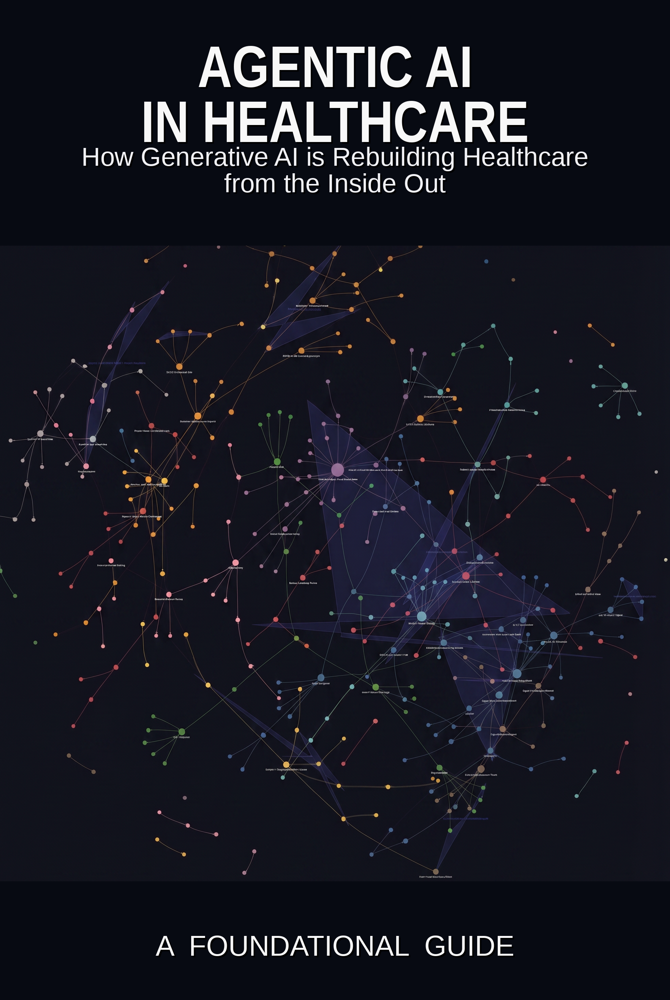

---
hide:
  - navigation
  - toc
---

  

<h1 align="center" style="margin-bottom:0;">Agentic AI in Healthcare</h1>

<em>How Generative AI is Rebuilding Healthcare from the Inside Out</em>

<strong>A Foundational Guide — Preview Edition</strong>

  <a class="md-button md-button--primary" href="01-anatomy-of-the-healthcare-enterprise/">Start reading</a>
  <a class="md-button" href="https://zkumar.github.io/healthcare-ai-book-graph/">Knowledge graph</a>
  <a class="md-button" href="https://github.com/zkumar/healthcare-ai-book-preview/issues">Share feedback</a>

---

This is a **preview edition** of a book in progress on how generative and agentic AI are beginning to reshape healthcare across MedTech, pharma, payer, provider, and consumer-health settings.

It is written for technology practitioners, healthcare builders, **students, and domain newcomers** who want a clear path into the sector — not only what the tools can do, but how healthcare context, regulation, data, workflow, governance, and trust shape whether those tools can be used responsibly.

## How to use this book

This is **not** a textbook that serves every answer on a plate. Healthcare AI is shaped by ambiguity, regulation, data quality, workflow constraints, clinical risk, business incentives, and human trust — it cannot be learned well through passive reading alone. The purpose is to **provoke thought as much as explain concepts**: the practitioner sections, simplified examples, and frameworks are starting points, not finished industrial implementations.

| Reader stance | What this book asks you to do |
|---|---|
| Don't only consume | Pause, question assumptions, and test whether an idea holds in a real healthcare context. |
| Don't memorize blindly | Understand why a method works, where it fails, and what constraints healthcare adds. |
| Don't treat examples as production systems | Use simplified code and rules as learning scaffolds, then investigate how industrial systems differ. |
| Don't wait for perfect understanding | Build small mental models, experiment responsibly, and refine them as your knowledge grows. |

*More in the [dedication and author note](dedication.md).*

## What's in the preview

- **[Chapter 1 — Anatomy of the Healthcare Enterprise](01-anatomy-of-the-healthcare-enterprise/index.md)**

    How the sectors — payer, provider, MedTech, pharma — actually fit together, and where AI lands in each.

- **[Chapter 2 — The Regulated Machine](02-the-regulated-machine/index.md)**

    Why healthcare is structurally different from every other domain AI has touched: the regulatory frameworks, the financial logic of care gaps, and the trust deficit.

- **[Chapter 3 — The Data Reality](03-the-data-reality/index.md)**

    The data beneath every healthcare AI system: claims, EHR, imaging, the missingness problem, and the standards that make interoperability possible.

Each chapter has a companion **Practitioner Depth** page with regulatory data snapshots and runnable, Colab-ready code.

## About the author

**Vijay Kumar Zharotia** — *Domain, Technology & AI Expert in a Box.* Thirty-plus years across regulated medical-device engineering, large-scale healthcare delivery, and modern agentic AI. His work spans MedTech, Payer, Provider, and Pharma — leading practices and advising executives across the sector. This book grew out of that work — an attempt to crystallize what he has learned and pass it forward.

[Read the full bio →](about.md)

## Dedication

> To **Ritika Zharotia**, my wife, whose patience, encouragement, and quiet strength have supported my learning, experimentation, and work across every difficult season.

> This is not a declaration that one person has the answer. It is an invitation to understand the system, learn its constraints, explore actively, and contribute responsibly to what healthcare AI becomes.

[Read the dedication and author note →](dedication.md)

## A living document

A book starts decaying the moment it ships — regulations shift, pathways evolve, citations go stale. This preview is built to stay current: it regenerates from the manuscript every time the source updates, so what you read tracks the latest thinking rather than a frozen snapshot.

## Feedback shapes the book

This preview exists to learn what's useful. If a chapter helped, confused, or missed something, please [open an issue](https://github.com/zkumar/healthcare-ai-book-preview/issues). Your feedback shapes the chapters still being written.
